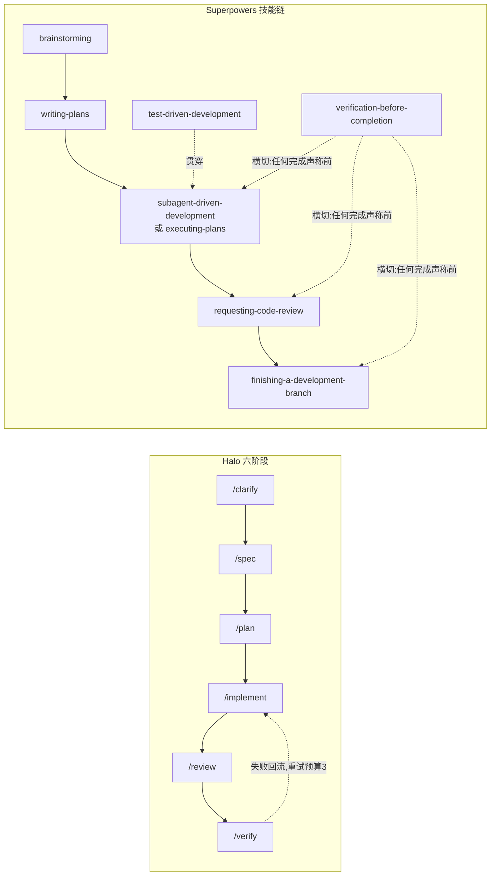

# Halo（PrismSpec）与 Superpowers 开发工作流对比分析

> 本文对比 Halo 的 `/clarify → /spec → /plan → /implement → /review → /verify` 六阶段工作流，与 Superpowers 的 `brainstorming → writing-plans → subagent-driven-development / executing-plans →（贯穿）test-driven-development → requesting-code-review / receiving-code-review → verification-before-completion → finishing-a-development-branch` 技能链。
>
> 目标：(1) 拆解两者每一步的内部流程，帮助理解实现逻辑；(2) 逐阶段对比功能逻辑异同；(3) 回答"某个开发环节应该二选一，还是合并取长补短"。
>
> 素材来源：Halo 侧为 `prismspec/skills/prismspec-*/SKILL.md`、`prismspec/bin/guide.sh`、`harness-template/halo/kernel/orchestrator/flow.yaml` 等；Superpowers 侧为 v6.1.1 插件的各 `SKILL.md` 及其附属 prompt 模板与脚本。关键断言均标注了来源文件，便于回查。

---

## 0. 先说结论（TL;DR）

**不需要二选一，而且 Halo 的官方设计意图本来就是"合并使用"。**

Halo 仓库中的 `prismspec/references/superpowers-alignment.md` 明确写道：

> "PrismSpec is not a fork of Superpowers. … Use Superpowers as the default behavioral reference for workflow discipline. … PrismSpec owns the artifact contract. … Do not create a PrismSpec-only behavior when a Superpowers skill already covers the same workflow discipline."

即官方分工是：

- **Superpowers 拥有"行为纪律"**：怎么提问、怎么写计划、怎么派子 agent、怎么做 TDD、怎么对待评审意见、什么时候才能说"完成"。
- **Halo/PrismSpec 拥有"产物契约与硬门禁"**：`spec.md` / `plan.md` / `review.md` / `verify.md` 四大持久产物、AC 追溯、任务证据目录、以及一整套用 shell 脚本实现的**机器可校验**门禁（lint / 证据门 / pipeline）。

两者的六个 PrismSpec skill 文件内部都有类似这样的自我声明（以 planning 为例）：

> "This skill aligns with Superpowers `writing-plans`: global constraints, concrete task interfaces, right-sized independently reviewable tasks … PrismSpec adds AC traceability, execution mode, and Halo evidence paths."

所以正确的问题不是"选谁"，而是"**在每个环节，行为层听谁的、产物层听谁的、冲突时听谁的**"。本文第 3 章给出逐环节建议表；官方的冲突优先级规则也在那里解读。

---

## 1. 总体架构对比

### 1.1 Halo：三层结构 + 磁盘状态机

Halo 的六个斜杠命令是**薄壳**，本身几乎不含逻辑，只做两件事：加载对应 skill、运行路由脚本。真正的分层是：

```
斜杠命令（薄壳）
   └─► prismspec/skills/prismspec-*/SKILL.md   ← 阶段行为逻辑（prompt 层）
          └─► shell 脚本                        ← 确定性门禁与状态（代码层）
                ├─ prismspec/bin/guide.sh          路由中枢
                ├─ orchestrator/sdd/*.sh           任务/证据/状态脚本
                └─ delivery/pipeline.sh + gates/   验证流水线
```

**路由中枢 `guide.sh` 是 Halo 最独特的设计**：它不依赖对话记忆，而是根据磁盘上的产物推断当前处于哪个阶段——

- 没有 `spec.md`（或 `status: clarifying` / `scaffolded: true`）→ specification
- 没有 `plan.md` → planning
- `plan.md` 里还有未勾选的 `- [ ]` 任务 → implementation
- 没有 review 证据 → review；没有 verify 证据 → verification；否则 done

它输出一份 JSON（当前阶段、下一步动作、缺失产物、验证命令等），任何一个新会话跑一次 `guide.sh` 就能接着上次的进度继续。**工作流状态 = 磁盘产物状态，天然可恢复、可中断、可多会话接力。**

阶段与门禁的引擎无关定义在 `flow.yaml`：每个阶段声明产物、gate、转移条件；specification 被标记为 `hard_gate`；verification 失败允许回流 implementation，重试预算 3 次。

### 1.2 Superpowers：纯 prompt 技能链 + 红线纪律

Superpowers 没有路由脚本、没有 lint、没有状态机。它是一组互相引用的 SKILL.md，靠三种机制约束行为：

1. **HARD-GATE / Iron Law 红线**：如 brainstorming 的"设计未获批准前禁止任何实现动作"、TDD 的 `NO PRODUCTION CODE WITHOUT A FAILING TEST FIRST`、verification 的 `NO COMPLETION CLAIMS WITHOUT FRESH VERIFICATION EVIDENCE`。
2. **反合理化表（Rationalization Table）与 Red Flags**：每个技能都预判了模型会怎么给自己找借口（"这太简单不需要测试""我已经手工测过了"），并逐条驳斥。这是 Superpowers 最鲜明的写作风格。
3. **子 agent prompt 模板 + 少量脚本**：SDD 附带 `implementer-prompt.md`、`task-reviewer-prompt.md` 两个派发模板，以及 `task-brief` / `review-package` 两个小脚本（从计划提取任务简报、把 diff 打包成文件）。

状态管理靠 **progress ledger**（`.superpowers/sdd/progress.md`，一行一条 `Task N: complete (commits …, review clean)`）加 `git log`。它解决的是"上下文压缩后控制器忘记做到哪了"的问题（skill 里记载真实事故：控制器丢失位置后把已完成的任务序列整个重派了一遍）。

### 1.3 阶段映射总表

| 开发环节 | Halo 命令 / skill | Superpowers 技能 | 关系 |
|---|---|---|---|
| 澄清意图 | `/clarify`（prismspec-grilling） | brainstorming 的前半段（提问环节） | Halo 把"追问"单独拆成一个可入口的阶段 |
| 形成规格 | `/spec`（prismspec-specification） | brainstorming 的后半段（方案→设计→批准→落盘） | 同构，Halo 落盘为 `spec.md` 契约 |
| 制定计划 | `/plan`（prismspec-planning） | writing-plans | 高度同源 |
| 执行实现 | `/implement`（prismspec-implementation） | subagent-driven-development + executing-plans + test-driven-development | Halo 把三者合并为一个阶段并加证据门 |
| 代码评审 | `/review`（prismspec-review） | requesting-code-review + receiving-code-review + SDD 内嵌的 task review | Halo 独立成阶段并结构化裁决 |
| 验证完成 | `/verify`（prismspec-verification） | verification-before-completion | 同一条铁律，Halo 加流水线 |
| 分支收尾 | **无对应阶段**（有 deploy / capture，但不管 merge/PR 决策） | finishing-a-development-branch | Superpowers 独有 |



---

## 2. 逐阶段细致流程拆解与对比

### 2.1 澄清 + 规格：`/clarify` + `/spec` vs `brainstorming`

这是唯一一处"两个 Halo 阶段对应一个 Superpowers 技能"的映射，因为 brainstorming 一个技能覆盖了从提问到设计落盘的全程；Halo 把"高压追问"独立拆成 grilling 模式（grilling 自己声明"不是新阶段，属于 Clarify，路由上仍归 specification"）。

#### Halo `/clarify`（prismspec-grilling）内部流程

1. 跑 `guide.sh --from=specification --json` 解析 host、spec 目录、spec-id、现有产物状态。
2. 若尚无 spec 且意图足够具体，用 `new.sh` 创建草稿，front matter 设 `status: clarifying`、保持 `scaffolded: true`。
3. **先查仓库再提问**：凡是代码/命令/模板/文档能回答的问题，禁止拿去问用户。
4. 提问聚焦**工程边界**：触达哪些模块/命令/门禁/adapter、契约是否变更、对 router/lint/CI/pipeline 的影响、与已有 spec 的兼容性、哪些行为**禁止**改动、用什么验证证据证明边界没有漂移。
5. **一次只问一个实质问题，且必须附带推荐答案和背后的取舍**。
6. 已解决的事实**回写进 `spec.md` 草稿**而不是留在聊天里：事实/约束进 Context Basis，已定选择进 scope / non-goals / 契约面，未决阻塞进 open questions，够具体的可测行为写成候选 AC。
7. 停止条件：下一个缺失决策真的必须由用户拍板；或草稿已可交给 specification 转正。

**门禁/禁区**：不得产出 `plan.md`、不得改生产代码、不得把状态推到 `drafted`（转正是 `/spec` 的职责）。不派子 agent。

#### Halo `/spec`（prismspec-specification）内部流程

skill 开头就有 HARD-GATE：**在非 scaffolded 的 `spec.md` 存在且设计获批（或审批状态被显式记录）之前，禁止 plan、实现、脚手架、改生产代码**。20 步工作流可归纳为：

1. `guide.sh` 探测路径 → 有界地探索项目上下文（明确说"不要读整个仓库"）。
2. 跨多个独立子系统的请求先**拆成多个 spec**。
3. 边界不清 → 进 grilling 模式；否则一次一问（能从代码推断的不问）。
4. 设计选择有分量时给 **2–3 个方案 + 取舍 + 推荐**；极小改动允许设计很短，但 scope 和 AC 仍必须显式。
5. **按风险形状选最小模板**：lite（低风险）/ service(API、数据、幂等、补偿) / frontend（UX、组件状态、无障碍）/ tdd（bug、回归、高风险行为）/ default。
6. 在 `spec.md` 内做 **Context Discovery**：只加载会改变 scope/AC/风险/接口/兼容/验证的上下文，选中的事实、约束、冲突、排除项写入 **Context Basis** 章节。
7. 呈现设计（intent/scope/approach/契约面/风险/执行模式/验证），**取得用户批准**；若批准是从"继续吧"之类指令推断的，要把这一点记录进 spec；若跳过批准，记录原因和风险。
8. 记录 `execution_mode`（plan 或 tdd）+ 理由 + 来源（模型选的/项目默认/用户覆盖）+ 审批状态。
9. 契约完整后才把 front matter 设为 `status: drafted`、`scaffolded: false`。
10. **自审**：占位符、矛盾、歧义、scope 蔓延、不可测 AC、缺 Context Basis、缺 mode、缺验证。
11. Halo 模式下跑 `spec-state-lint.sh` 才允许离开本阶段。

产物：带 Context Basis、稳定 `AC-{n}` 编号、执行策略、审批状态的 `spec.md`。可按需调用支撑 skill（source-grounding 防外部 API 知识过期、doubt-review 对高风险假设做对抗检查、interface-design 处理契约变更）和可选的 spec-reviewer 子 agent。

#### Superpowers `brainstorming` 内部流程

同样有 HARD-GATE（呈现设计并获用户批准前禁止任何实现动作），并单独驳斥"这太简单不需要设计"——待办清单、单函数工具、配置改动全都要走流程，设计可以只有几句话，但必须呈现并获批。9 步检查清单（要求逐项建 todo）：

1. 探索项目上下文（文件、文档、近期提交）。
2. **恰时（just-in-time）提供可视化伴侣**：不预先推销；第一次遇到"展示比描述更清楚"的问题时，用单独一条消息提议打开浏览器伴侣（用于 mockup/图表/布局对比）。接受后也要**逐问题判断**用浏览器还是终端——"UI 话题"不等于"视觉问题"。
3. 逐个提问：一次一问、优先选择题，理解目的/约束/成功标准。请求含多个独立子系统时**立即标记**，先帮用户分解成子项目（每个子项目各走一遍 spec→plan→实现），不要浪费问题在细化一个本该拆分的项目上。
4. 提出 2–3 个方案 + 取舍，**先讲推荐项及理由**。
5. 分节呈现设计（按复杂度伸缩，每节后确认），覆盖架构、组件、数据流、错误处理、测试。设计原则：单元职责单一、接口清晰、能独立理解和测试；文件过大即"做太多"的信号。
6. 把设计写成文档并 **git commit**。
7. **Spec 自审 4 项**：占位符扫描、内部一致性、范围（是否需要拆分）、歧义（能否两种解读）。内联修复，不需要复审。
8. **用户审阅门**：告知路径请用户审阅书面 spec，等回复；有改动就改完重跑自审，批准后才继续。
9. **终态固定**：唯一可调用的下游技能是 writing-plans（明文禁止直接跳到 frontend-design 等实现技能）。

附属的 `spec-document-reviewer-prompt.md` 提供可选 spec 审阅子 agent（查完整性/一致性/清晰度/范围/YAGNI，仅严重缺陷才拦截）。

#### 对比

| 维度 | 共通 | Halo 独有 | Superpowers 独有 |
|---|---|---|---|
| 核心纪律 | 一次一问、2–3 方案 + 推荐、设计批准 HARD-GATE、落盘 + 自审 + 用户审阅、过大请求先分解 | — | — |
| 提问质量 | — | **每个问题必须附推荐答案和取舍**；先查仓库再提问的硬规定；追问清单锁定工程边界（禁改文件、契约、验证证据） | 可视化伴侣（浏览器 mockup 对比）；"UI 话题≠视觉问题"的逐题判断 |
| 产物结构 | — | `spec.md` 是**结构化契约**：Context Basis、稳定 AC-{n}、execution_mode（plan/tdd 影响后续证据要求）、审批状态字段、按风险分级的 5 种模板 | 设计文档是**自由体散文**，无结构化字段 |
| 机器校验 | — | `spec-state-lint.sh` 硬校验 + `status: clarifying→drafted` 状态机 + `new.sh` 脚手架 | 无（自审是 prompt 行为） |
| 断点恢复 | — | 澄清成果写进 `status: clarifying` 草稿，换会话可续 | 依赖对话上下文 |

**小结**：行为层两者几乎逐条同构（specification skill 自己写明 "aligns with Superpowers brainstorming … differs only in the artifact contract"）。Halo 的增量是把对话成果变成**可 lint、可路由、带 AC 编号**的契约；Superpowers 的增量是对话体验层的打磨（推荐答案 Halo 也有，可视化伴侣 Halo 没有）。

---

### 2.2 计划：`/plan` vs `writing-plans`

这一对同源程度最高，连"全局约束"这个概念都是同一个词（Halo 直接叫 `全局约束`，Superpowers 叫 Global Constraints，且两边都强调"逐字从 spec 复制"）。

#### Halo `/plan`（prismspec-planning）内部流程

1. 读 `spec.md`，识别 AC、scope、风险、执行模式。
2. 勘察代码定位实现边界。
3. 写 `全局约束` 块：**逐字**拷贝 spec 中的项目级约束（版本下限、依赖限制、命名/文案规则、数据格式、平台要求、不变量）。明确规定"不要放泛化流程规则，只放本 spec 的绑定事实"——它是 implementer 和 reviewer 共享的"注意力透镜"。
4. 建依赖顺序，优先**纵向薄切片**而非按层横切。
5. **Task right-sizing**：任务是"能独立实现、测试、评审、恢复的最小单元"；setup/配置/文档折叠进需要它们的任务；只在"评审者可能拒绝这个任务却批准邻居任务"处才拆分。
6. 发现风险需要红测试证据时升级 `plan → tdd`（禁止反向静默降级）。
7. 写 `plan.md`：每个任务带 checkbox、`覆盖验收: AC-n`、模式、范围、接口契约（输入/输出/依赖边界）、涉及文件、验证方式（精确命令）、执行步骤（写测试→跑出预期失败→改实现→重跑通过→回归）、证据路径、完成条件。TDD 任务先列 `RED-{n}`（含预期失败原因——必须是"行为缺失"而非环境/语法错）再列实现任务。
8. **No Placeholders 红线**：TBD/TODO/"以后实现"、"加适当校验"不给具体 case、"类似任务 N"、只写"run tests"不给命令、使用未定义的类型/路由/字段名、只说目标不说改哪里跑什么——全部算**计划失败**。
9. **自审 6 项**（以未来 task reviewer 的视角）：AC 覆盖（每个 AC 至少一个任务 + 一条验证路径）、约束传播、占位符扫描、接口/类型跨任务一致、reviewer 预检（计划强制了会被评审判缺陷的东西要先浮出冲突）、**零上下文可执行**（新 implementer 只拿一个任务 + 全局约束 + 相关接口就能干活）。
10. Halo 模式下跑 `plan-lint.sh` 机器校验，然后 `spec-status.sh <id> planned --from=drafted` 推进状态。

#### Superpowers `writing-plans` 内部流程

核心心态开宗明义：**假设执行工程师对代码库零上下文、技术娴熟但品味存疑、不懂本工具链和领域、不太会设计测试**——所以什么都要写全。

1. **Scope check**：多子系统的 spec 本应在 brainstorming 拆掉；没拆就建议拆成多份计划，每份独立产出可测试软件。
2. **File structure 先行**：定任务前先规划创建/修改哪些文件、各自单一职责；按职责拆分而非按技术层；一起变的文件放一起。
3. Task right-sizing：与 Halo 逐字级相同（最小可测评审单元、折叠 setup、按"评审者可拒一留一"拆分）。
4. **Bite-sized 步骤**：每步一个动作（2–5 分钟）——写失败测试 / 跑出失败 / 写最小实现 / 跑到通过 / 提交。
5. **计划头模板强制**：`REQUIRED SUB-SKILL` 指向 SDD（推荐）或 executing-plans、Goal、Architecture、Tech Stack、Global Constraints（逐字复制，"每个任务的需求隐含包含本节"）。
6. **任务结构**：Files（Create/Modify/Test 精确路径含行号）、Interfaces（Consumes/Produces 精确签名——"implementer 只看到自己的任务，靠这块了解邻居任务的名称和类型"）、带 checkbox 的步骤，**代码步骤必须给出真实代码块**、命令带预期输出、含提交命令。
7. No Placeholders 红线：与 Halo 几乎逐条相同（多一条理由："类似 Task N"不行是因为工程师可能乱序读任务）。
8. **自审 3 项**（明确说"自己跑，不是派子 agent"）：spec 覆盖、占位符扫描、类型一致性（"Task 3 叫 `clearLayers()`、Task 7 叫 `clearFullLayers()` 就是 bug"）。
9. **执行交接**：保存后向用户提供两个选项——Subagent-Driven（推荐）或 Inline Execution，按选择调用对应技能。

附属 `plan-document-reviewer-prompt.md` 提供可选计划审阅子 agent。

#### 对比

| 维度 | 共通 | Halo 独有 | Superpowers 独有 |
|---|---|---|---|
| 核心纪律 | 全局约束逐字拷贝、任务定型规则、接口契约块、No Placeholders 红线、零上下文实现者假设、自审 | — | — |
| 追溯性 | — | **每个 AC 必须被至少一个任务引用**；任务行内声明 `覆盖验收: AC-n`；`plan-lint.sh` 机器强制 | 自审里有"spec 覆盖"，但只靠人肉扫，没有稳定 AC 编号可供机器 diff |
| 执行模式 | — | plan/tdd 双模式在计划层显式路由，TDD 任务有独立 `RED-{n}` 结构和预期失败原因字段 | TDD 内嵌在每个任务的 bite-sized 步骤里（写测试→跑失败→实现→跑通过→提交） |
| 计划粒度 | — | 步骤到"改哪个文件、跑什么命令、预期什么结果" | 更细：**计划里直接嵌入完整代码块**，实现退化为"誊写 + 测试"（这也是它模型分级策略的基础） |
| 状态推进 | — | `spec-status.sh drafted→planned` 带转移守卫 | 计划头写死下游技能名，靠 prompt 约定 |

**小结**：这是"Halo 按 Superpowers 抄作业再加校验层"最明显的一节。值得注意的差异是计划粒度哲学：Superpowers 倾向把**代码本身**写进计划（换取用便宜模型誊写），Halo 只要求写到"文件 + 命令 + 预期结果"级别，代码留给 implementer 现场写。前者对"计划一次写对"的要求更高，后者对 implementer 的能力要求更高。

---

### 2.3 实现:`/implement` vs `subagent-driven-development` + `test-driven-development`（+ `executing-plans`）

Halo 把 Superpowers 的三个技能压缩进一个阶段：SDD 的派发纪律成为其"Subagent Execution Loop"小节，TDD 成为其 `tdd` 执行模式，executing-plans 对应其无子 agent 时的默认路径。

#### Halo `/implement`（prismspec-implementation）内部流程

1. 检查 worktree 状态，避免混入无关改动。
2. **`task-next.sh <spec-id> --json` 取下一任务**（不靠猜、不靠会话记忆）；返回 `complete` 时转去跑证据 lint + 推进状态而不是改代码。
3. 在证据目录生成任务简报（brief）。
4. 按模式执行：`plan` 直接实现 + 为行为变化补测试；`tdd` 走严格循环（见下）。
5. 子 agent 可用且任务可隔离时，优先走 Subagent Execution Loop。
6. 跑聚焦验证 → 写 implementer report（commit 范围、改动文件、测试结果、疑虑）→ 生成 review package。
7. TDD 任务写结构化 `tdd-evidence.json`。
8. **只能用 `task-complete.sh` 勾选任务**——这是一个**证据门**：`brief.md` 或 `review-package.md` 缺失、TDD 任务的 `tdd-evidence.json` 缺失或无效（脚本会校验 red 的 exit code ≠ 0、green 的 exit code = 0、ac_ids 非空）时直接拒绝勾选。红旗清单明文禁止手改 `plan.md` 的 checkbox。
9. 跑 `task-evidence-lint.sh` 校验已完成任务的证据。
10. 全部任务完成后 `spec-status.sh <id> implemented --from=planned`。

**Subagent Execution Loop**（与 SDD 同构）：读/建 progress ledger → 记录 base commit → 派只带"brief + 全局约束 + 相关接口 + 报告路径 + 测试契约"的全新 implementer → 按 `DONE / DONE_WITH_CONCERNS / NEEDS_CONTEXT / BLOCKED` 四状态处理（BLOCKED 时"改上下文、改模型、改任务大小或升级，禁止原样重试"）→ 从 base commit 生成 review package → 派只读 task reviewer → Critical/Important 修完才算完成 → ledger 追加一行 → 全部任务后做一次 whole-branch 终审。明文禁止"把之前任务的完整历史 diff 粘进后续派发"。

**TDD Cycle**（与 Superpowers TDD 同构且同样严格）：RED（一个 AC/风险一个最小测试）→ Verify RED（精确命令，失败原因必须是"行为缺失"而非 setup 噪音）→ GREEN（最小生产改动）→ Verify GREEN（聚焦 + 回归命令）→ REFACTOR（绿后才清理）→ 记录证据（AC id、测试文件/名、red/green 的命令、exit code、摘要）。"先写了实现代码就删除或隔离出最终变更，从测试重来"、"不得为省事削弱/删除/改写有效的红测试"。

#### Superpowers `subagent-driven-development` 内部流程

核心公式：**每任务一个全新 implementer 子 agent + 每任务后一次双裁决 task review + 全部完成后一次 whole-branch 终审**。子 agent 绝不继承会话历史——控制器精确构造它需要的一切。

1. **连续执行**：任务之间不停下来问人（"要继续吗？"被明文定性为浪费伙伴时间）；只有 BLOCKED 无解、真歧义、全部完成三种停机理由。
2. **Pre-flight 计划审查**：派 Task 1 前扫描计划找冲突（任务互相矛盾、与 Global Constraints 矛盾、计划强制了评审 rubric 视为缺陷的东西），**打包成一个问题**问用户"以哪个为准"；干净则静默继续。
3. **模型分级**（要求每次派发显式指定模型）：机械任务（1–2 文件、规格完整）用最便宜档，计划含完整代码时实现 = 誊写 + 测试也用最便宜档；集成/判断任务用标准档;架构/设计和 whole-branch 终审用最强档；并提醒"轮次数比 token 单价更贵"——太便宜的模型多跑 2–3 倍轮次反而更贵。
4. 每任务循环：`task-brief` 脚本从计划提取该任务全文到唯一文件 → 派 implementer（派发 prompt 只含 5 项：任务在项目中的定位一句话、brief 路径、邻居任务的接口/决定、控制器对 brief 歧义的裁定、报告文件路径与合约）→ implementer 可先提问 → 实现、测试、提交、自审、写报告文件，只返回状态 + 提交 + 一行测试摘要 + 疑虑。
5. 四状态处理：DONE → `review-package BASE HEAD` 打包 diff（BASE 用派发前记录的 commit，**绝不用 `HEAD~1`**——会静默丢掉多提交任务的前几个提交）→ 派 task reviewer；DONE_WITH_CONCERNS → 先读疑虑，正确性/范围类先处理；NEEDS_CONTEXT → 补上下文重派；BLOCKED → 四段决策（补上下文同模型 / 升级模型 / 拆小任务 / 计划本身错则升级人类），**绝不原样重试**。
6. **Reviewer prompt 构造纪律**（本技能篇幅最大的一节）：不加无理由的开放指令；不让 reviewer 重跑 implementer 已跑过的测试；**绝不预判**——prompt 里出现 "do not flag"、"至多 Minor"、"计划选的"就停下，"你在预判，通常是为了逃避一轮评审循环"；全局约束块逐字拷贝作为 reviewer 的注意力透镜；diff 以文件交付；一个派发只描述一个任务（记载真实事故：42k 字符的派发 99% 是粘贴的历史）；Critical/Important 派 fix 子 agent、Minor 记 ledger 留给终审分诊；plan-mandated 的 finding 是人类的决定；每个 fix 派发都带"重跑覆盖测试并报告"契约，确认报告含测试文件+命令+输出三件套才重派评审；终审有 finding 时派**一个** fix 子 agent 带完整清单（记载事故：per-finding 派 fixer 的成本超过了全部任务之和）。
7. **⚠️ 项处理**：reviewer 报"无法从 diff 验证"的跨任务/未变更代码项，控制器（唯一持有跨任务上下文的人）必须逐一亲自核实，确认是真缺口就按 spec 评审失败退回。
8. **Durable progress ledger**：技能开始先 `cat` ledger，已标完成的任务绝不重派；评审干净就追加一行；压缩后"信 ledger 和 git log，不信自己的记忆"。
9. 全部任务完成 → 用 requesting-code-review 的模板派 whole-branch 终审（最强模型 + `review-package MERGE_BASE HEAD`）→ 转 finishing-a-development-branch。

`implementer-prompt.md` 给 implementer 的合约：先读 brief、开工前可提问、TDD、迭代跑聚焦测试提交前跑全套、自审四维（完整性/质量/YAGNI 纪律/测试）、"力所不及即升级"（架构多解、需要超范围理解、反复读文件无进展→BLOCKED/NEEDS_CONTEXT）、报告写文件、返回≤15 行。

`task-reviewer-prompt.md` 给 reviewer 的合约:只读；**把 implementer 报告当声明不当证据**；不重跑已跑过的测试（除非读码起了具体疑心）；Part 1 spec 合规（Missing/Extra/Misunderstood，无法验证报 ⚠️）+ Part 2 代码质量（关注点分离、错误处理、DRY、边界、测试验的是真行为、文件是否被这次改动撑得过大），每个 finding 给 file:line；输出双裁决。

#### Superpowers `executing-plans`（内联替代方案）

3 步：读计划并**批判性审查**（有顾虑先提再开始）→ 逐任务精确按步执行（计划已是 bite-sized）→ 全部完成后强制转 finishing-a-development-branch。碰阻塞/看不懂/验证反复失败就**停下来问，不猜**。技能自己会告知用户"有子 agent 的平台效果好得多，有就改用 SDD"。

#### 对比

| 维度 | 共通 | Halo 独有 | Superpowers 独有 |
|---|---|---|---|
| 派发纪律 | 全新子 agent + 文件化交接（brief/report/review-package）+ 四状态协议 + BLOCKED 禁止原样重试 + ledger + 每任务双裁决评审 + whole-branch 终审 | — | — |
| 任务调度 | — | **`task-next.sh` 从 `plan.md` 机器解析下一任务**，跨会话确定性续作 | 控制器读计划自建 todos，靠 ledger 防丢 |
| 完成判定 | — | **`task-complete.sh` 证据门**：证据文件不齐拒绝勾选；`task-evidence-lint.sh` 事后复检；TDD 需结构化 `tdd-evidence.json` | 完成 = reviewer 双裁决通过（prompt 层约定，无机器强制） |
| 成本控制 | — | 未涉及 | **模型分级选择**（含"轮次数比单价更贵"的经济学）、"计划含完整代码→最便宜模型誊写" |
| TDD | 同一套 red-green-refactor + 强制 Verify RED/GREEN + "先写了代码就删掉重来" | 证据落盘为 JSON，供 ac-coverage 等 gate 消费 | **反合理化火力**（11 条借口逐条驳斥）+ `testing-anti-patterns.md`（绝不测 mock 行为、绝不给生产类加测试专用方法、绝不在不理解依赖时 mock，5 个反模式各带 Gate Function） |
| 无子 agent 时 | — | 同一 skill 内降级为逐任务自己做（流程不变，证据照产） | 独立的 executing-plans 技能，含"批判性审查计划"前置步 |

**小结**：Halo 的 Subagent Execution Loop 是 SDD 的忠实压缩版（连 DONE_WITH_CONCERNS 这种状态名都一致），但 SDD 原版的**操作细节密度高得多**——模型分级、42k 字符派发事故、`HEAD~1` 陷阱、fix 派发三件套确认、per-finding fixer 成本事故，这些都是 Halo 压缩时丢掉的实战经验。反过来，Halo 用脚本把 SDD 靠自觉维护的东西（下一个任务是谁、任务能不能算完成）变成了机器判定。**这一环节两者互补性最强。**

---

### 2.4 评审：`/review` vs `requesting-code-review` + `receiving-code-review`

Halo 把评审独立成一个阶段并给出结构化产物；Superpowers 把评审拆成"怎么请求"和"怎么接收"两种纪律，且任务级评审已内嵌在 SDD 里。

#### Halo `/review`（prismspec-review）内部流程

1. 确认实现任务已完成（或指出阻塞评审的未完成任务）。
2. 读 `spec.md`、`plan.md`、任务证据、review packages。
3. **按风险选最小 reviewer 集**（四种 persona）：spec-reviewer（scope/AC/模式变了时）、task-reviewer（常规任务评审）、test-reviewer（tdd 模式、测试大改、AC-测试追溯不确定时）、risk-reviewer（涉及安全/权限/金钱/数据/迁移/并发/幂等/不可逆行为时）。反合理化表里专门有一条："一个 reviewer 覆盖所有风险"是错的，但也只在任务真正触达的风险维度上加 persona。
4. **只读评审**：除最终评审产物外不得改动工作树、index、HEAD、分支、证据。
5. 对**四轴**给裁决：Spec 符合度 / 代码质量 / 测试覆盖 / 风险控制，取值 `pass | fail | cannot_verify`。
6. **缺证据一律 `cannot_verify`，不是 pass**——"cannot_verify 差不多等于过了"被列为典型合理化。
7. 写中文 `review.md`（front matter + 评审结论表 + 四轴表 + 检查范围 + 发现项 + 已检查证据 + 风险与处置）；Halo 模式下用 `review-summary.sh` 一次生成 `review.md` + 机器可读的 `review-summary.json`（供 pipeline/eval 摄取）。任务级评审把 `branch` 换成任务 id。
8. Critical/Important 发现**阻塞进入 verification**；Minor 记为残余风险或后续项。
9. **接收外部评审意见的协议**（与 Superpowers receiving-code-review 同构）：读完整反馈 → 不清楚的先复述/先问 → 对照代码/spec/plan/测试/证据核实 → 与项目契约冲突时用技术推理反驳 → 一次实现一条、逐条验证。产物里要求给每条反馈一个处置：accepted / rejected with reason / cannot_verify / needs user decision。

#### Superpowers `requesting-code-review` 内部流程

1. 时机：SDD 每任务后（强制）、大功能完成后（强制）、合并 main 前（强制）；卡住时/重构前/修完复杂 bug 后（可选）。核心口号"review early, review often"。
2. 取 BASE/HEAD SHA → 派 general-purpose 子 agent 填 `code-reviewer.md` 模板（占位符：改了什么、需求是什么、SHA 范围）——**reviewer 拿到的是精确构造的上下文，绝不是会话历史**。
3. 模板要求 reviewer：只读（要看其他 revision 就 `git worktree add` 到独立目录）；五维检查（计划对齐/代码质量/架构/测试/生产就绪）；按真实严重度分级、先说优点、显著偏离计划要点明、计划本身有问题也要说；输出 Strengths + Issues（Critical/Important/Minor 各带 file:line、为何重要、如何修）+ 明确裁决（Ready to merge: Yes/No/With fixes）。
4. 处理反馈：Critical 立即修、Important 继续前修、Minor 记录、**reviewer 错了就带技术理由反驳**。红线：不因"简单"跳评审、不忽略 Critical、不带未修 Important 继续、不跟正确的技术反馈抬杠。

#### Superpowers `receiving-code-review` 内部流程

核心原则："**先验证再实现，先询问再假设，技术正确性高于社交舒适**。代码评审要技术评估，不要情绪表演。"

1. 六步响应模式：READ（读完不反应）→ UNDERSTAND（复述或问）→ VERIFY（对照代码库现实）→ EVALUATE（对本代码库技术上成立吗）→ RESPOND（技术确认或有理反驳）→ IMPLEMENT（一次一条、逐条测试）。
2. **禁止的响应**："You're absolutely right!"、"Great point!"、"Let me implement that now"（验证前）、任何感谢用语——"行动说话，代码本身证明你听进去了；要写 Thanks 就删掉，改成陈述修复"。
3. 任何一条不清楚 → 全部停下先问清（"各条可能相关，部分理解 = 错误实现"）。
4. 来源区分：人类伙伴的反馈受信任（理解后实现，范围不清仍要问）；外部 reviewer 的反馈先过 5 关（对本库正确吗/破坏现功能吗/现状有原因吗/跨平台版本吗/reviewer 懂全局吗）。
5. **YAGNI 检查**：被建议"正经实现"的功能先 grep 实际用法，没人调用就反问"删掉（YAGNI）？"。
6. 实现顺序：先澄清全部 → 阻塞性（破坏/安全）→ 简单修复 → 复杂修复，逐条测试。
7. 反驳错了就大方纠正（"You were right—我查了 X 确实 Y，现在实现"），不长篇道歉不辩解。

#### 对比

| 维度 | 共通 | Halo 独有 | Superpowers 独有 |
|---|---|---|---|
| 评审员纪律 | 只读、报告当声明不当证据、按真实严重度分级、不预判 reviewer、Critical/Important 阻塞 | — | — |
| 裁决结构 | — | **四轴 × 三值（pass/fail/cannot_verify）**结构化裁决；"缺证据 = cannot_verify ≠ pass"的显式第三态；`review-summary.json` 机器可读侧车，供流水线/评估消费 | 裁决是散文式（Strengths/Issues/Assessment），无第三态（reviewer 用 ⚠️ 表达"无法从 diff 验证"，由控制器人肉消化） |
| 评审员组织 | — | **四种 persona 按风险维度按需组合**（spec/task/test/risk-reviewer） | 单一 code-reviewer 模板 + SDD 的 task-reviewer 双裁决 |
| 接收方纪律 | 核实后再实现、不清先问、技术反驳 | 要求给每条反馈落一个**处置枚举值** | **反表演条款**（禁 "You're absolutely right!"、禁一切感谢）、YAGNI grep 反问法、反驳错误后的体面纠正话术、GitHub 线程回复的具体命令 |

**小结**：Halo 在"评审产出什么"上更强（结构化、机器可读、有第三态），Superpowers 在"评审怎么请求、意见怎么消化"上更强（模板打磨、社交反模式防御）。Halo 的 review skill 第 11 步实际上就是 receiving-code-review 的内化转述。

---

### 2.5 验证：`/verify` vs `verification-before-completion`

两者共享同一条铁律，Halo 的 HARD-GATE 措辞几乎是 Superpowers Iron Law 的翻版：

- Superpowers：`NO COMPLETION CLAIMS WITHOUT FRESH VERIFICATION EVIDENCE`（"这条消息里没跑验证命令，就不能声称它通过"）。
- Halo：`Do not say done, fixed, passing, complete, verified, or equivalent unless the proving command was run in the current verification pass and the result is recorded.`

#### Halo `/verify`（prismspec-verification）内部流程

1. `guide.sh --json` 解析验证命令。
2. Halo 模式：跑 `pipeline.sh --json-out`——按 flow.yaml，流水线依次过 **9 道 gate**：`bootstrap → spec-lint → build → lint → unit-test → ac-coverage → integration-test → drift-check → compliance`。其中 `ac-coverage` 检查 AC↔测试 的追溯覆盖率（spec 里的 AC-n 必须有对应测试），`drift-check` 检测 spec 与代码的漂移，`compliance` 是行为合规软门。exit 0 = 全绿，1 = 可重试失败，2 = 需人工升级。
3. Standalone 模式：按语言检测最小命令集（Node: build/lint/test；Python: ruff/pytest；Go: `go test ./...`；Rust: `cargo test`）。
4. 把**精确命令、exit code、输出摘要、AC 完成情况、跳过的检查、残余风险、后续动作、知识候选**写入 `verify.md`。
5. **读完整输出、确认 exit code 之后才允许做任何状态判断**。
6. 失败原因不能从输出直接解释时，先进 `prismspec-debugging`（系统化调试）再改代码。
7. 可重试失败在 scope 内修复重跑；不可重试的带具体后续步骤升级。flow.yaml 定义 `on_fail: fix, max_retries: 3`，且 `verification -> implementation` 是合法转移（失败回流）。
8. 通过后才 `spec-status.sh <id> verified --from=implemented`。之后可选 `/capture` 沉淀知识、或 deploy。

#### Superpowers `verification-before-completion` 内部流程

它不是一个"阶段"，而是**横切所有环节的门函数**——任何"声称状态或表达满意"之前都要过：

1. IDENTIFY：什么命令能证明这个声称。
2. RUN：完整地、新鲜地跑这条命令。
3. READ：读全部输出、查 exit code、数失败数。
4. VERIFY：输出支持声称吗？不支持就如实报真实状态附证据。
5. 然后才声称。"跳过任何一步 = 撒谎，不是验证。"

配套三张表：**常见失败对照表**（"测试通过"需要"本次输出 0 失败"，"上次跑过/应该过"不算；"bug 修好"需要"原始症状的测试通过"，"改了代码"不算；"回归测试有效"需要"红绿循环验证"——写→过→回退修复→必须失败→恢复→过；"agent 完成了"需要"查 VCS diff"，"agent 报成功"不算）；**Red Flags**（"should/probably/seems"、验证前的"Great!/Perfect!/Done!"、累了想收工）；**合理化预防表**（"我有信心"→信心≠证据；"linter 过了"→linter≠编译器；"换个说法规则就不适用了"→精神胜于字面）。

#### 对比

| 维度 | 共通 | Halo 独有 | Superpowers 独有 |
|---|---|---|---|
| 铁律 | 无新鲜命令证据不得声称完成；读全输出 + 查 exit code 后才判定 | — | — |
| 验证内容 | — | **九道流水线 gate**，其中 `ac-coverage`（AC↔测试追溯）和 `drift-check`（spec-代码漂移）是 spec 驱动开发特有的验证维度，超出"测试过没过" | 需求核对靠"重读计划→建清单→逐条验证"的人肉流程 |
| 产物 | — | 持久 `verify.md`（命令、exit code、AC 完成、残余风险、知识候选）+ eval run JSON——"durable evidence 是完成记录和未来恢复点" | 无产物，验证证据只存在于当前消息 |
| 失败处理 | — | 结构化：exit 1 可重试（预算 3 次）回流 implementation，exit 2 升级；不明失败先进 debugging skill | 声明"如实报状态"，无回流结构 |
| 适用面 | — | 是一个**阶段终点** | 是一个**横切门**：不止验证阶段，SDD 标记任务完成、finishing 跑测试、任何一句"Done!"之前都适用 |

**小结**：定位不同——Superpowers 的是"随时随地的诚实纪律"，Halo 的是"带流水线的验证阶段"。合用时恰好互补：前者管住每一次小声称，后者管住最终交付。

---

### 2.6 收尾：`finishing-a-development-branch`（Halo 无对应）

Halo 的工作流终点是 verification（skill 原文："Verification is the main PrismSpec workflow endpoint"），之后是可选的 deploy（流水线部署 + smoke test）和 `/capture`（知识沉淀）。**"这个分支现在怎么办"——本地 merge、推送开 PR、保留、丢弃——Halo 完全没有覆盖**。Superpowers 用一个专门技能补这块：

1. **Step 1 验证测试**：跑项目测试套件；失败就展示失败并**停止**，不进下一步。
2. **Step 2 检测环境**：比较 `git rev-parse --git-dir` 与 `--git-common-dir`——相等 = 普通仓库；不等 + 命名分支 = worktree；不等 + 游离 HEAD = 外部托管工作区。这决定菜单和清理方式。
3. **Step 3 确定基分支**：`git merge-base HEAD main/master`，不确定就问。
4. **Step 4 呈现选项**：普通仓库/命名分支 worktree **恰好 4 项**（本地 merge / 推送开 PR / 保留 / 丢弃）；游离 HEAD **恰好 3 项**（无 merge）。不加解释，保持简洁——"开放式的'接下来做什么'是含糊的"。
5. **Step 5 执行**：merge 路径要 cd 到主仓根、checkout 基分支、pull、merge、**在合并结果上重跑测试**，确认成功后才清理；PR 路径 push 后**不清理 worktree**（用户要留着迭代 PR 反馈）；丢弃路径要求用户**键入 'discard'** 才执行强删。
6. **Step 6 清理工作区**：只有选项 1、4 清理；且只清理自己创建的 worktree（在 `.worktrees/` 下的），harness 拥有的不碰;remove 前必须 cd 出 worktree,之后 `git worktree prune`。

红线包括：带失败测试继续、未在合并结果上验证就算 merge 成功、无确认删工作、删分支前没先移 worktree（`git branch -d` 会失败）等——全是 git 实操坑。

**小结**：这是 Superpowers 的净增量，与 Halo 无重叠、无冲突，可直接原样采用作为 `/verify` 通过之后的下一步。

---

### 2.7 横切维度对比

| 维度 | Halo（PrismSpec） | Superpowers |
|---|---|---|
| **状态与恢复** | 磁盘产物状态机：`guide.sh` 任何时刻从产物推断阶段；`spec-status.sh` 带守卫推进 drafted→planned→implemented→verified；换会话/换 agent 无缝续作 | progress ledger + git log：解决上下文压缩后的失忆,但阶段感知靠模型自觉 |
| **门禁性质** | **机器硬门**：spec-state-lint / plan-lint / task-complete 证据门 / task-evidence-lint / 九道 pipeline gate——模型想合理化也过不去脚本 | **prompt 软门**：HARD-GATE、Iron Law、反合理化表——防御深度来自把借口预先写出来逐条驳斥，但最终仍靠模型遵守 |
| **追溯链** | Intent → spec(AC-n) → plan(任务引用 AC) → 测试(ac-coverage 校验) → review(四轴) → verify(AC 完成表)，全链机器可查 | spec → plan → task → review 靠自审和 reviewer 人肉对齐，无稳定编号 |
| **子 agent 运用** | implementer + 4 种 reviewer persona；文件化交接 | implementer + task reviewer + code reviewer + fix subagent + 可选 spec/plan reviewer；文件化交接 + 模型分级 + 状态协议打磨得更细 |
| **实战经验密度** | 中：规则完备但偏"规范体" | 高：大量真实事故内嵌（42k 字符派发、HEAD~1 丢提交、per-finding fixer 成本爆炸、重派已完成任务、"24 条失败记忆"） |
| **人机交互打磨** | 一次一问 + 推荐答案 | 可视化伴侣、反表演条款、批量化打断（pre-flight 一次问完）、"连续执行不问'要继续吗'" |
| **对话之外的资产** | spec/plan/review/verify 四产物 + 证据目录 + eval/loop/learn 体系（知识沉淀、失败分类、回归评估） | 设计文档 + 计划文档 + ledger（scratch，git-ignored） |

---

## 3. 结论：怎么选、怎么合

### 3.1 官方立场及其解读

`prismspec/references/superpowers-alignment.md` 给出的冲突优先级（原文四条）：

1. 安全与用户指令最高。
2. **产物位置和 Halo 门禁**：PrismSpec/Halo 项目里听 PrismSpec 的。
3. **工作流纪律**（人机交互、计划纪律、TDD 纪律、评审纪律、完成纪律）：听 Superpowers 的。
4. 冲突会改变产品行为、范围、执行模式或风险时：停下来问用户。

以及"反造轮子检查"：给 PrismSpec 加规则前先问——Superpowers 是否已解决这个行为？PrismSpec 的改动是否只关乎产物形状/AC 追溯/上下文发现/Halo 验证？能否表达成"映射到 Superpowers + 一个产物覆盖"？三问有一为"是"就引用而不是重造。

这个立场经得起本文第 2 章的逐阶段检验：六个 PrismSpec skill 的行为规则确实是 Superpowers 对应技能的转述 + 产物层增量，没有发现两者在行为纪律上的实质冲突（只有覆盖密度差异）。

### 3.2 逐环节选型建议

| 环节 | 建议 | 理由与做法 |
|---|---|---|
| 澄清/设计 | **合并**：行为按 brainstorming，落盘按 Halo | 对话纪律两边等价；但把成果写进带 AC-n 和 Context Basis 的 `spec.md` 而不是自由体设计文档——后续 plan-lint、ac-coverage、drift-check 全靠这些结构化字段。Halo 的"问题必须带推荐答案"值得保留；Superpowers 的可视化伴侣按需取用 |
| 计划 | **合并**：结构按 Halo，粒度参考 Superpowers | 用 Halo 的 plan.md 模板（AC 引用 + 证据路径 + plan-lint 可校验）；对将派给便宜模型的机械任务，学 writing-plans 把**真实代码块**写进任务步骤，让实现退化为誊写 |
| 实现 | **合并**：调度和完成判定用 Halo，派发经验用 Superpowers | `task-next.sh` / `task-complete.sh` 证据门是 Halo 的核心价值（机器防"假完成"），保留;但派发时执行 SDD 的细则：显式指定模型分级、BASE commit 用记录值而非 HEAD~1、派发 prompt 五要素、fix 派发三件套确认、终审只派一个 fixer。TDD 按 Superpowers 原版（含 testing-anti-patterns），证据落 Halo 的 tdd-evidence.json |
| 评审 | **合并**：产物用 Halo，接收纪律用 Superpowers | 四轴 × pass/fail/cannot_verify + review-summary.json 是 Halo 净优势（第三态 + 机器可读）；消化评审意见时执行 receiving-code-review 全套（先验证、禁表演式赞同、YAGNI grep、一次一条） |
| 验证 | **合并**：横切门用 Superpowers，阶段终点用 Halo | verification-before-completion 管住全程每一句"Done"；`/verify` 的九道 pipeline（尤其 ac-coverage、drift-check）+ 持久 verify.md 管住最终交付。两者层次不同，天然叠加 |
| 收尾 | **直接用 Superpowers** | Halo 无此环节。`/verify` 通过后接 finishing-a-development-branch 的四选项菜单，作为标准衔接 |

### 3.3 合并使用的注意事项（重叠处怎么取舍）

1. **两套 brief / review-package 脚本并存**：Halo 的 `task-brief.sh` / `review-package.sh`（产出到 `.halo/sdd/`，且被 `task-complete.sh` 证据门检查）与 Superpowers 的 `scripts/task-brief` / `scripts/review-package`（产出到 `.superpowers/sdd/`）功能同构。**在 Halo 项目里用 Halo 版**——否则证据门找不到文件会拒绝勾选任务；这正是优先级规则第 2 条（产物位置听 PrismSpec）的具体案例。
2. **两套 progress ledger**：同理，Halo 项目用 `.halo/sdd/<spec-id>/progress.md`，不要再建 `.superpowers/sdd/progress.md`，避免双源。
3. **设计文档去哪**：brainstorming 默认写 `docs/superpowers/specs/`，alignment 文件明确覆盖为"写进 spec.md"。不要产出两份。
4. **HARD-GATE 只认一个**：两边的 specification/brainstorming 门语义相同，遵守其一即遵守双方；不存在"先过 brainstorming 批准、再过 spec 批准"的两次审批——设计批准记录进 spec.md 的审批状态字段即闭环。
5. **Superpowers 的技能触发机制很激进**（using-superpowers 要求"1% 可能相关就必须调用"）。在 Halo 项目里，若 `/spec` 等命令已加载 prismspec skill，就按 prismspec skill 执行（它内部已引用 Superpowers 纪律），不必再显式叠加调用同构的 Superpowers 技能，避免双重流程。
6. **Halo 没有的、可整体引入的 Superpowers 资产**：finishing-a-development-branch（收尾）、testing-anti-patterns（mock 反模式）、模型分级选择、systematic-debugging（Halo 的 prismspec-debugging 与之对齐，但原版更详尽）。

### 3.4 一句话总结

**把 Superpowers 当"行为操作系统"，把 Halo 当"落在磁盘上的存证与门禁层"**：对话怎么进行、子 agent 怎么派、什么时候能说"完成"，听 Superpowers；成果落成什么文件、任务算不算完成、交付过不过关，听 Halo。两者的重叠不是竞争而是同一套纪律的两种实现强度（prompt 软约束 vs 脚本硬校验），叠加使用时软约束防"想歪"，硬校验防"做假"，防御纵深恰好互补。唯一需要主动决策的只是第 3.3 节列出的六个重叠点——原则一律是：**产物与路径归 Halo，行为与经验归 Superpowers**。
