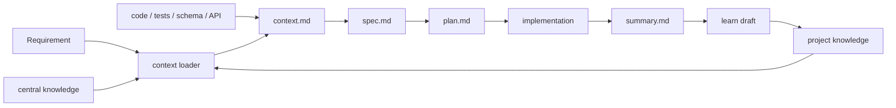

# Context 设计

## 定位

Lattice 的 Context 层是 AI Coding 的上下文补齐系统。它不是企业知识库，也不是代码搜索引擎，而是把一次需求真正需要的项目事实、历史决策、领域规则和外部知识，收敛成可审计的输入。

核心目标：

- 让 Agent 在写 spec 前先加载项目约束，而不是只依赖模型先验。
- 让每次迭代都有 `context.md`，记录本次采用了哪些依据、忽略了哪些信息、还缺什么。
- 让项目内知识库和中心知识库联动，但项目真实约束优先。
- 让可复用经验能在交付后回写，形成持续改进闭环。

## 目录结构

```text
lattice/
├── context/
│   ├── sources.yaml
│   └── knowledge/
│       ├── project/
│       │   ├── index.md
│       │   └── synonyms.txt
│       ├── central/
│       └── drafts/
├── specs/
│   └── <spec-id>/
│       ├── context.md
│       ├── spec.md
│       ├── plan.md
│       └── summary.md
└── state/
    └── context-runs/
```

| 路径 | 职责 |
|------|------|
| `lattice/context/sources.yaml` | 声明上下文来源、包含/排除规则、冲突策略。 |
| `lattice/context/knowledge/project/` | 项目级持久知识：业务规则、架构决策、接口约定、踩坑记录。 |
| `lattice/context/knowledge/central/` | 中心知识库缓存：团队规范、通用实践、跨项目经验。 |
| `lattice/context/knowledge/drafts/` | `/learn` 或失败复盘生成的候选知识，人工确认后进入 project。 |
| `lattice/specs/<spec-id>/context.md` | 单次需求的上下文依据，是 spec 的直接输入。 |
| `lattice/state/context-runs/` | 后续用于记录检索日志、命中结果和评估数据。 |

## 运行流程



Brainstorming 阶段必须完成两件事：

1. 读取 `lattice/manifest.yaml` 和 `lattice/context/sources.yaml`。
2. 用需求关键词运行 `bash lattice/kernel/context/loader.sh <keywords>`，再结合相关代码、测试、schema、接口契约写出 `lattice/specs/<spec-id>/context.md`。

后续 Plan/TDD/Verify 阶段默认消费 `context.md` 和 `spec.md`，不重复把项目全部背景重新塞进 prompt。

## `context.md` 建议结构

```markdown
# Context: <spec-id>

## User Intent
- 原始需求和确认过的边界。

## Selected Knowledge
| Source | Entry | Why it matters |
|--------|-------|----------------|
| project | `payment-idempotency` | 影响 AC 和测试设计 |
| central | `api-error-contract` | 约束错误码格式 |

## Code Facts
- 相关模块、接口、测试、schema、配置。

## Contract Facts
- API、事件、数据库、权限、错误码等外部可见契约。

## Conflicts
- 冲突事实、优先级判断、需要用户确认的点。

## Open Questions
- 不确认会影响 spec 正确性的问题。

## Exclusions
- 本次明确不采用或不处理的信息。
```

`context.md` 不追求长，而追求可追溯。它应该回答：本次设计为什么相信这些信息。

## 知识条目格式

建议项目知识使用 front matter，方便后续做 stale/conflict/lint：

```markdown
---
id: payment-idempotency
type: rule
scope: project
status: accepted
tags: [payment, idempotency]
source: "incident review, 2026-06-28"
owner: platform
updated_at: 2026-06-28
expires_at:
---

# Payment Idempotency

## Rule
All payment mutations require an idempotency key.

## Applies When
- Creating, retrying, or replaying payment write operations.

## Evidence
- Link to incident, spec, code, or test.
```

应存入 `project/` 的内容：

- 长期有效的业务不变量；
- 接口契约、错误码、鉴权、幂等等跨需求约束；
- 架构决策和被拒绝方案；
- 事故复盘中可复用的踩坑记录；
- 项目术语、命名规范、边界规则。

不建议存入：

- 大段源码；
- 临时会议碎片；
- 与项目无关的通用 prompt 技巧；
- 没有来源、适用范围和状态的“传闻式规则”。

## 中心知识库联动

中心知识库解决跨项目复用问题，但不应该凌驾于项目事实之上。

推荐优先级：

1. 用户本次明确指令；
2. 项目知识 `context/knowledge/project/`；
3. 当前代码、测试、schema、接口契约；
4. 当前项目已有 specs；
5. 中心知识 `context/knowledge/central/`；
6. 模型先验。

冲突策略默认是 `project-wins`。当中心知识和项目代码或项目知识冲突时，Agent 应记录到 `context.md` 的 `Conflicts`，必要时向用户确认。

## 与 PrismSpec 的关系

PrismSpec 负责 SDD 工作流；Context 负责给这个工作流提供可信输入。

| 阶段 | Context 作用 | 产物 |
|------|--------------|------|
| Brainstorming | 检索知识、读代码事实、识别冲突和问题 | `context.md`、`spec.md` |
| Planning | 基于 spec/context 拆任务和验证证据 | `plan.md` |
| Implementation | 遵守 context 中的约束，不重新解释背景 | 代码、测试、task evidence |
| Verification | 检查 spec/context/knowledge 引用是否可审计 | gate output |
| Finishing | 把可复用经验生成 learn draft | `summary.md`、knowledge draft |

## 当前 Gap

| Gap | 影响 | 优先级 |
|-----|------|--------|
| `context.md` 还主要依赖 skill 约定生成 | 不同 Agent 输出质量会波动 | P0 |
| knowledge front matter 未强校验 | 过期、无来源知识可能被误用 | P0 |
| loader 仍是关键词/同义词检索 | 命中质量有限，但足够启动 | P1 |
| central sync 只有基础 Git 同步 | 缺少 schema、权限和冲突报告 | P1 |
| context-runs 未结构化 | 暂时无法分析命中率和误用率 | P2 |

## 推荐演进

1. 增加 `context-lint`：校验 `context.md`、knowledge front matter、source、status、owner。
2. 让 PrismSpec brainstorming skill 强制生成 `context.md`。
3. 让 `loader.sh` 输出命中记录到 `lattice/state/context-runs/`。
4. 为 central knowledge 增加只读团队包和本地覆盖策略。
5. 在 compliance gate 中把 context 引用、知识引用和 open questions 结构化输出。
