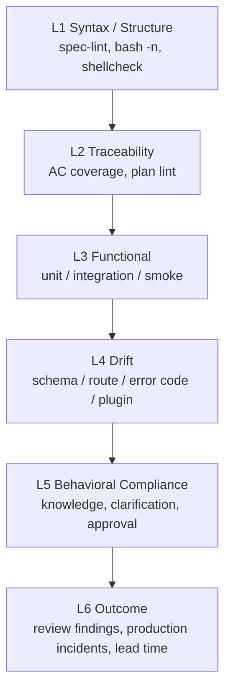

# Eval 设计

## Eval 在 Lattice 中的定位

Eval 不是简单的“跑测试”。在 Lattice 中，Eval 应该回答三个问题：

1. 这次交付是否满足 Spec？
2. 这次 Agent 工作过程是否可靠？
3. 这个团队的 AI coding 能力是否在变好？

当前实现已经具备 eval 的原材料：pipeline 输出、AC 覆盖矩阵、drift check 结果、compliance warning。但它们还主要是终端文本，没有形成结构化数据集和趋势指标。

## 当前 eval 形态

| 来源 | 当前输出 | 可评价内容 |
|------|----------|------------|
| `spec-lint.sh` | pass/fail + 缺失章节 | Spec 是否可执行 |
| `ac-coverage.sh` | coverage matrix | AC 是否有测试追踪 |
| `drift-check.sh` | drift diagnostics | Spec 与代码是否偏移 |
| `compliance.sh` | warnings | 是否引用知识、是否有澄清痕迹 |
| build/lint/test | terminal output | 工程基础质量 |
| pipeline summary | pass/fail/skip | 交付是否可声明完成 |

这些属于 deterministic eval：用脚本检查结构、命令和可复现证据。

## 推荐 eval 分层



推荐优先做 L1-L4，因为它们确定性更强、误报更低。L5-L6 可先做记录和人工复核，不要过早自动判死刑。

## Eval 数据模型

建议新增运行记录目录：

```text
lattice/state/eval-runs/
└── 2026-06-26T12-34-56Z.json
```

单次运行记录：

```json
{
  "run_id": "2026-06-26T12-34-56Z",
  "project": "my-api",
  "git_sha": "abc1234",
  "spec_file": "lattice/specs/create-item.md",
  "spec_hash": "sha256:...",
  "agent": "claude-code",
  "pipeline": {
    "status": "fail",
    "duration_ms": 18342,
    "retry_count": 1
  },
  "steps": [
    {
      "name": "spec-lint",
      "status": "pass",
      "duration_ms": 120,
      "summary": "12 sections, 5 ACs"
    },
    {
      "name": "ac-coverage",
      "status": "fail",
      "duration_ms": 210,
      "metrics": {
        "ac_total": 5,
        "ac_covered": 4,
        "coverage": 0.8
      },
      "findings": ["AC-5 uncovered"]
    }
  ]
}
```

这会让 eval 从“终端输出”升级为“可比较数据”。

## 核心指标

短期指标：

| 指标 | 含义 |
|------|------|
| pipeline pass rate | 完整流水线通过率 |
| first-pass pass rate | 首次运行即通过比例 |
| AC coverage | Spec AC 被测试追踪的比例 |
| drift count | 规约与代码漂移数量 |
| retry count | Agent 修复轮数 |
| escalation count | 超出重试预算的次数 |
| compliance warnings | 知识/澄清/审批相关 warning 数 |

中期指标：

| 指标 | 含义 |
|------|------|
| spec churn | approved 后 Spec 被修改次数 |
| missed AC rate | review 或线上发现的漏验收比例 |
| knowledge hit rate | 需求设计阶段知识命中比例 |
| knowledge miss rate | 事后发现应有知识但未命中比例 |
| plugin drift distribution | 哪类漂移最常发生 |

长期指标：

| 指标 | 含义 |
|------|------|
| defect escape rate | gate 通过后仍逃逸的问题 |
| lead time impact | 使用 Lattice 后需求交付周期变化 |
| review finding density | 每次 review 发现的问题密度 |
| reusable knowledge impact | 某知识条目是否降低同类失败 |

## Eval 与 CI

Lattice 的 eval 最终应该能在本地和 CI 中一致运行。

推荐方式：

```bash
bash lattice/kernel/delivery/pipeline.sh \
  --spec lattice/specs/create-item.md \
  --json-out lattice/state/eval-runs/latest.json
```

短期可以先不改变现有 stdout，只增加可选 JSON 输出，避免破坏 agent 阅读终端证据的体验。

## Eval 与 Agent 评估

如果要比较不同 agent 或不同提示词策略，建议固定以下变量：

- 同一个 repo snapshot
- 同一个 requirement
- 同一个 knowledge snapshot
- 同一个 Spec 模板
- 同一个 pipeline
- 独立记录 agent、model、prompt/rules 版本

评估维度：

| 维度 | 判断方式 |
|------|----------|
| 需求理解 | Spec review finding 数 |
| 实现可靠性 | first-pass pass rate、retry count |
| 测试质量 | AC coverage、deep warnings、review findings |
| 漂移控制 | drift count |
| 知识使用 | knowledge hit/miss、compliance warnings |

## 主要 gap

| Gap | 影响 | 建议 |
|-----|------|------|
| 只有文本输出 | 无法做趋势分析 | 增加 JSON evidence |
| 无 run identity | 无法追踪一次完整尝试 | 增加 run_id、git_sha、spec_hash |
| 无耗时/重试数据 | 无法评估效率 | 每个 step 记录 duration 和 retry_count |
| Eval 与 knowledge 未关联 | 不知道知识是否真的有效 | 记录 matched knowledge entries |
| 缺少人工 review 结果 | 只知道 gate 结果，不知道语义质量 | 增加 review findings schema |

## 推荐演进

短期：

- `pipeline.sh` 支持 `--json-out`。
- 每个 gate 输出一段 machine-readable summary。
- CI 上传 `lattice/state/eval-runs/*.json` 作为 artifact。

中期：

- 增加 `lattice eval report` 类脚本，汇总最近 N 次结果。
- 增加 review finding schema，把人工审查结果也纳入 eval。
- 关联 knowledge hit 与 failure 类型。

长期：

- 建立团队级 eval dashboard。
- 支持跨 agent / prompt / kernel version 对比。
- 形成 regression suite：用历史需求和历史 bug 回放验证 Lattice 版本升级是否有效。
