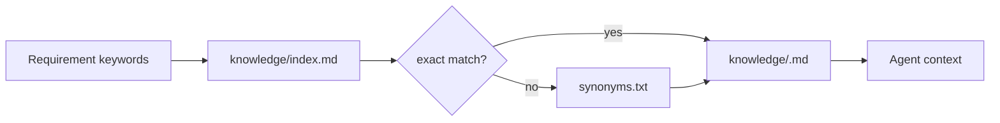
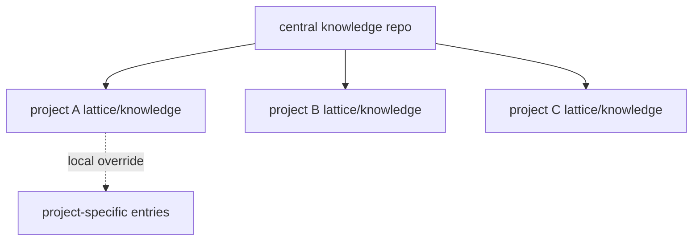

# 知识库设计

## 定位

Lattice 的知识库不是代码真相源，也不是大而全的企业知识平台。它是项目级 context retrieval + governance layer，用来把代码库之外的约束显式注入到 SDD 流程中。

核心原则：

- Code remains truth：代码、测试、schema、运行输出仍是真相源。
- Knowledge is retrieval layer：知识库用于召回规则、决策、踩坑和团队约定。
- Query-first：按需求关键词检索，不把全量知识常驻 prompt。
- Evidence-aware：知识条目必须有来源、适用范围和更新时间。

## 当前结构

```text
lattice/knowledge/
├── index.md
├── synonyms.txt
└── <slug>.md

lattice/kernel/knowledge/
├── loader.sh
├── sync.sh
└── README.md
```

`index.md` 负责检索入口：

```markdown
- `payment-idempotency` | keywords: payment, idempotency, fund | 所有支付操作需要幂等键
```

知识文件负责承载内容：

```markdown
# Payment Idempotency Rules

**Keywords**: payment, idempotency, fund
**Core rule**: All payment mutations require an idempotency key.
**Source**: 2026-06-26 incident review
**Context**: ...
```

## 检索流程



当前 `loader.sh` 的优点：

- 零服务依赖
- 离线可用
- 容易审计
- 对几十到几百条团队规则足够实用

当前限制：

- 关键词召回弱
- 无 ranking
- 无结构化元数据
- 无过期检测
- 无置信度
- 不能区分 code-extracted 与 human-authored

## 知识应该存什么

优先存高稳定、高复用、跨需求会反复踩坑的内容。

| 类型 | 示例 | 是否推荐 |
|------|------|----------|
| 命名规范 | API 字段 camelCase，DB 字段 snake_case | 推荐 |
| 业务不变量 | 支付扣款必须幂等，订单状态只允许单向流转 | 推荐 |
| 架构决策 | 为什么不用某个缓存策略 | 推荐 |
| 事故教训 | 某接口不能批量重放，因为会触发重复结算 | 推荐 |
| 接入说明 | 内部服务鉴权、错误码规范 | 推荐 |
| 临时会议纪要 | 未确认的讨论记录 | 谨慎 |
| 大段代码复制 | 直接从源码拷贝几百行 | 不推荐 |
| 个人 prompt 技巧 | 与项目无关的 agent 使用经验 | 不推荐 |

推荐 rollout 顺序：

1. `code/schema/ADR/README` 中确定性的规则
2. 高频业务不变量和接口约定
3. 线上事故、review 发现的 pitfall
4. 跨项目共享的通用工程规则
5. 会议、图片、视频等 noisy source 只在有明确提炼后进入

## 防腐设计

知识库最大的风险不是“不够聪明”，而是过期后仍被 Agent 信任。

建议给每条知识增加结构化字段：

```yaml
---
id: payment-idempotency
title: Payment idempotency rules
keywords: [payment, idempotency, fund]
source_type: incident
source_ref: docs/incidents/2026-06-payment-dup.md
owner: platform-team
created_at: 2026-06-26
updated_at: 2026-06-26
expires_at: 2026-12-31
confidence: verified
truth_scope: payment-service
---
```

关键字段：

| 字段 | 作用 |
|------|------|
| `source_type` | 区分 code、ADR、incident、manual、LLM-derived |
| `source_ref` | 指回来源，便于审计 |
| `owner` | 谁负责维护 |
| `expires_at` | 到期后提醒复核 |
| `confidence` | verified / inferred / ambiguous |
| `truth_scope` | 避免跨项目误用 |

## 中央知识库

当前 `sync.sh` 支持从 central repo pull/push，适合后续做跨项目复用。

推荐模式：



治理建议：

- 默认 read-only，下游项目本地补充。
- 只有 verified、跨项目通用的规则进入 central。
- central 条目必须带 owner 和 source_ref。
- 冲突策略默认 `prefer-local`，避免中心知识覆盖项目真实差异。

## 与 RAG / Code Graph 的关系

Lattice 当前不应该急着变成完整 RAG 或 code graph 系统。

合理分工：

| 层 | 真相强度 | 适合内容 |
|----|----------|----------|
| Code truth layer | 最高 | 源码、测试、schema、配置 |
| Structural index layer | 高 | AST、routes、symbols、call chain |
| Team rules layer | 中高 | ADR、业务规则、命名规范 |
| LLM-derived layer | 中低 | 总结、推断、会议提炼 |
| Governance layer | 横切 | 来源、置信度、过期、owner |

后续可以接入 RAG 或 code graph，但它们应该作为 retrieval/index plugin，而不是替代 code truth。

## 主要 gap

| Gap | 影响 | 建议 |
|-----|------|------|
| index 是手写文本 | 难以校验、难以排序 | 增加 `knowledge/index.yaml` 或 front matter 自动生成 |
| 无来源/置信度 | Agent 无法判断可不可信 | 增加 metadata 和 confidence |
| 无 stale 检查 | 过期规则会误导实现 | 新增 `knowledge-lint.sh` |
| learn 只是约定 | 失败经验无法自动沉淀 | 从 pipeline failure 生成 learn draft |
| 无 query log | 不知道哪些知识被命中或缺失 | 记录 loader query/evidence |

## 推荐演进

短期：

- 为知识条目增加 front matter。
- 增加 `knowledge-lint.sh`：检查 metadata、source_ref、过期时间、index 一致性。
- `/learn` 生成 draft，默认不直接进入 verified。

中期：

- 增加 query log：记录 requirement、keywords、matched entries、missed keywords。
- 支持 ranking：exact > synonym > tag > fuzzy。
- 支持中心知识库 read-only 拉取和本地 override。

长期：

- 接入 embeddings / FTS / AST index 作为可选 plugin。
- 建立知识健康报告：stale、conflict、unused、high-hit entries。
- 将 verified knowledge 和 eval 结果关联，衡量知识条目是否减少失败。
