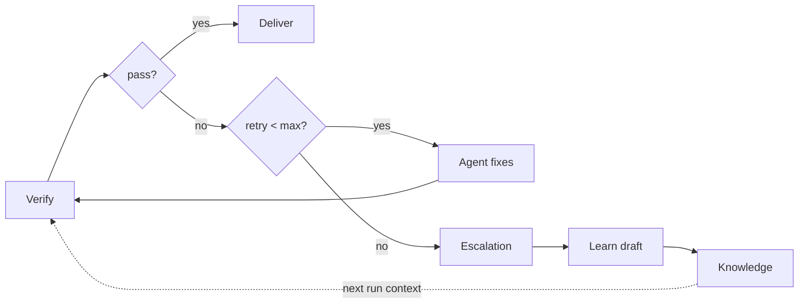
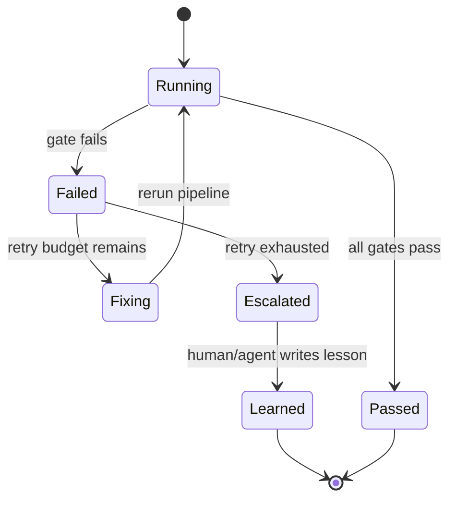

# Loop 设计

## Loop 是什么

Lattice 的 loop 指从验证失败到修复、重跑、升级和知识沉淀的闭环。



Loop 的目的不是让 Agent 无限自修复，而是建立一个可控循环：

- 能修的自动修
- 不能修的及时升级
- 升级后的经验进入知识库
- 下一次同类问题更早被规约或验证拦住

## 当前实现

当前 `pipeline.sh` 已支持：

- 读取 `SH_RETRY_COUNT`
- 读取 `SH_RETRY_MAX`，默认 3
- 任一步失败后停止
- 重试耗尽时 exit `2`，输出 escalation 诊断

这已经具备最小 verify-fix-rerun loop。

当前缺失：

- retry count 需要 agent 外部设置，没有自动状态记录
- 失败原因没有结构化分类
- escalation 没有生成可沉淀的 learn draft
- loop 与 knowledge 的连接仍是人工约定

## Loop 状态机

推荐把 loop 显式建模为状态机：



对应状态文件：

```text
lattice/state/loops/
└── <run_id>.json
```

示例：

```json
{
  "run_id": "2026-06-26T12-34-56Z",
  "spec_file": "lattice/specs/create-item.md",
  "git_sha": "abc1234",
  "status": "failed",
  "retry_count": 2,
  "retry_max": 3,
  "last_failed_step": "drift-check",
  "failure_category": "route_drift",
  "failure_summary": "Spec route POST /items not registered in code",
  "next_action": "fix_code"
}
```

## 失败分类

为了让 loop 能沉淀知识，需要将失败分类。

| 类别 | 例子 | 默认动作 |
|------|------|----------|
| environment | 缺 yq、docker 未启动 | 修环境或提示用户 |
| spec_structure | 缺章节、AC 跳号 | 修 Spec |
| implementation | build/lint/test 失败 | 修代码 |
| ac_gap | AC 没有测试 | 补测试或调整 Spec |
| drift | API/DDL/error code 不一致 | 修代码或更新 Spec |
| compliance | 未引用知识、无澄清记录 | 补记录或人工确认 |
| unknown | 无法自动判断 | escalation |

分类可以先从 gate name + regex 开始，不必一开始就引入复杂模型。

## Learn 回路

`/learn` 当前定义了知识条目格式，但尚未和 pipeline failure 自动连接。

推荐流程：

1. pipeline 失败并超过重试预算
2. 生成 `lattice/state/learn-drafts/<run_id>.md`
3. Agent 或人类整理成知识条目
4. 通过 review 后进入 `lattice/knowledge/`
5. 更新 `knowledge/index.md`

draft 示例：

```markdown
# Draft: route drift in create item API

**Failure category**: drift
**Failed step**: drift-check
**Spec**: lattice/specs/create-item.md
**Evidence**: Spec route POST /items not registered in code
**Suggested knowledge**: When adding Gin APIs, register route in internal/handler/router.go and add TestAC coverage.
**Status**: draft
```

这样可以避免把每次失败都直接污染知识库。

## Loop 与 SDD 的关系

Loop 不只发生在 coding 后，也应该反哺 SDD：

| Loop 发现 | 应反哺位置 |
|-----------|------------|
| 多次 build fail | plan 拆分太粗或技术选型缺失 |
| AC uncovered | Spec 的 test strategy 不够明确 |
| drift 高频 | Spec 与代码之间缺少强 schema 或 plugin |
| compliance warning | design 阶段知识加载不足 |
| escalation 高频 | retry budget 或任务粒度不合理 |

## Loop 与 Eval 的关系

Loop 过程天然产生 eval 数据：

- 第几轮通过
- 哪个 gate 最常失败
- 哪类失败最容易被 Agent 自修复
- 哪类失败必须人工介入
- 哪些知识条目减少了重试次数

这些数据可以帮助团队判断 Lattice 是否真的提升交付质量，而不是只增加流程负担。

## 主要 gap

| Gap | 影响 | 建议 |
|-----|------|------|
| retry 状态不落盘 | 无法复盘完整修复链路 | 增加 loop state JSON |
| failure 无分类 | 无法统计和学习 | 增加 failure_category |
| learn 不自动生成 draft | 经验沉淀依赖人工记忆 | pipeline escalation 生成 learn draft |
| 没有 spec hash | 无法判断同一 loop 是否换过 Spec | 记录 spec_hash |
| 无人工介入记录 | escalation 后结果丢失 | 增加 resolution 字段 |

## 推荐演进

短期：

- 在 pipeline summary 中输出 failed_step、retry_count、建议动作。
- 增加可选 `--state-out`，落盘 loop JSON。
- escalation 时生成 learn draft。

中期：

- 增加 `lattice loop status` 和 `lattice loop report`。
- 将 failure_category 纳入 eval report。
- 支持按 spec_id 聚合多次 loop。

长期：

- 建立 historical failure memory。
- 对高频失败自动建议新增 gate 或知识条目。
- 将 loop 数据用于 agent/prompt/kernel version 的回归评估。
