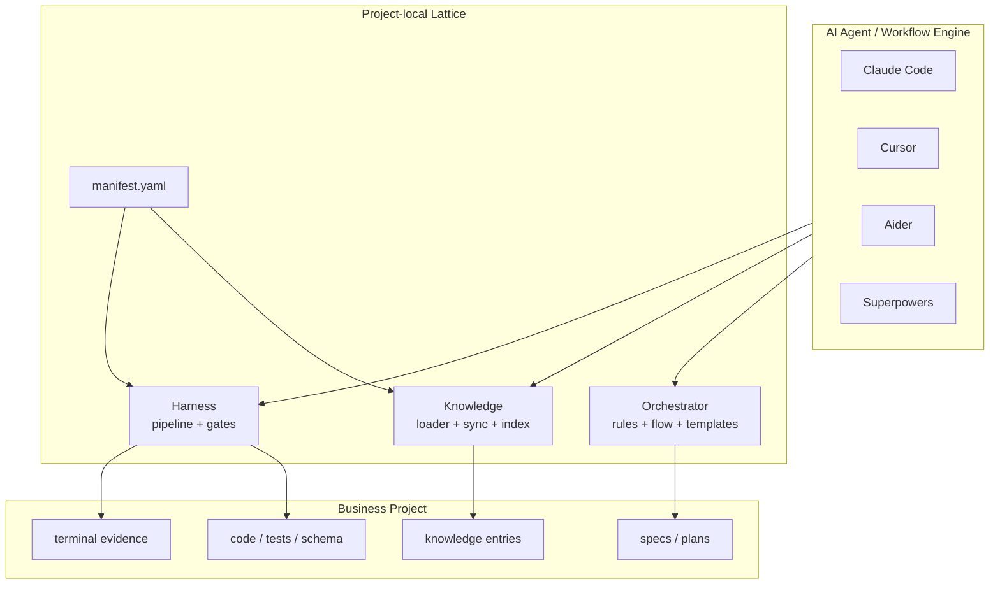
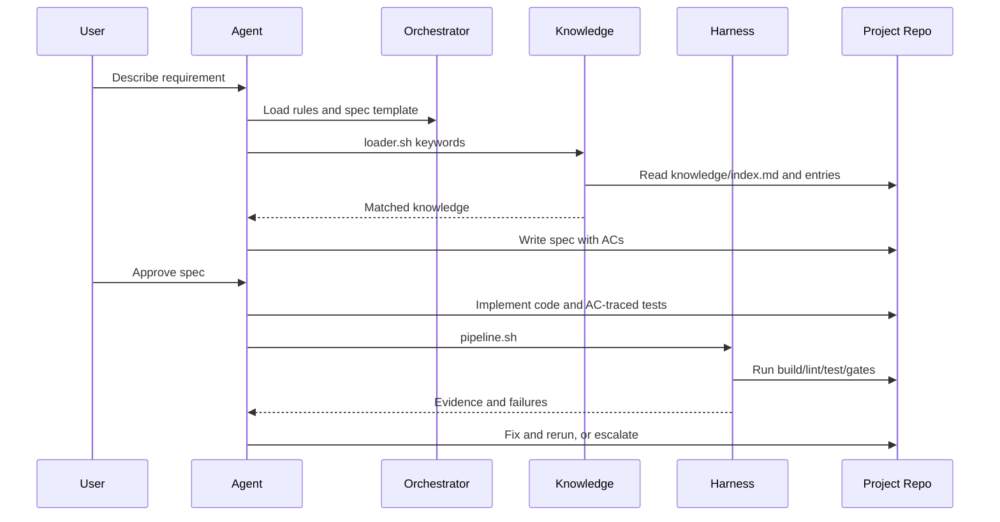

# 整体设计

## 定位

Lattice 是一个安装进业务仓库的 AI coding harness。它不拥有 IDE、模型、Agent 运行时或云端调度，而是通过项目内文件和 shell 命令，为现有 agent 增加四类能力：

| 能力 | 解决的问题 | 当前载体 |
|------|------------|----------|
| Context | Agent 缺少业务规则、历史决策和团队约定 | `lattice/knowledge/`、`loader.sh` |
| Spec | 需求口头化、实现过程难追踪 | `spec-template.md`、`lattice/specs/` |
| Harness | Agent 自评不可信，交付缺少外部证据 | `pipeline.sh`、`gates/` |
| Eval | 无法比较一次 AI coding 是否真的变好 | gate 输出，后续扩展为结构化 eval |

核心判断：Lattice 最适合做项目级 engineering harness，而不是做 workflow engine 或 agent platform。

## 系统边界



Lattice 的边界很克制：

- Agent 负责理解、编辑、调度和修复。
- Lattice 负责给 Agent 约束、上下文和外部验证入口。
- 业务仓库仍然是代码、测试、规约和知识资产的归属地。
- CI/CD、权限、生产发布仍由项目自己的系统负责，Lattice 只提供可插拔入口。

## 分层架构

### 1. Orchestrator layer

目录：`lattice/kernel/orchestrator/`

职责：

- 定义开发阶段：brainstorming、planning、implementation、verification、finishing、deploy
- 约束 Spec 格式和 AC 编号
- 要求实现任务和测试命名追踪到 AC
- 通过 `rules.md` 被 agent 导入

当前形态是 prompt-level control plane，不是严格状态机。这带来两个结果：

- 优点：容易适配 Claude Code、Cursor、Aider、Superpowers 等不同 agent。
- 代价：agent 是否严格遵守规则，仍需要 delivery layer 事后验证。

### 2. Knowledge layer

目录：`lattice/kernel/knowledge/` 与 `lattice/knowledge/`

职责：

- 根据 requirement 关键词检索项目知识
- 输出命中的知识条目给 agent 作为设计输入
- 支持中心知识库 pull/push
- 通过 `/learn` 约定沉淀新经验

当前实现是关键词 + 同义词表，适合小规模、低依赖、离线可用的团队实践。它不是 RAG 平台，也不是知识真相源。

### 3. Delivery layer

目录：`lattice/kernel/delivery/`

职责：

- 读取 `manifest.yaml`
- 按 pipeline steps 执行 bootstrap、build、lint、test、AC coverage、drift check、compliance
- 通过 exit code 表达 pass/fail/escalation
- 输出可复制到 PR 或交付说明里的证据

Delivery layer 是当前最接近“可运行产品”的部分，也是 Lattice 技术路线成立的关键，因为它把 agent 的自然语言承诺变成了外部命令判据。

## 数据流



## 可插拔设计

Lattice 的可插拔性来自“文件契约 + 命令契约”，不是来自复杂框架。

| 插件点 | 当前协议 | 可替换对象 |
|--------|----------|------------|
| Agent adapter | 导入 `rules.md`，能执行 shell | Claude Code、Cursor、Aider、Superpowers |
| Pipeline step | `manifest.yaml` 中的 `pipeline.steps[].run` | 任意构建、测试、扫描命令 |
| Drift plugin | `drift.plugins[].run` | proto、OpenAPI、DB migration、自定义架构扫描 |
| Knowledge source | `knowledge.central.repo`、本地 index | 中央知识库、项目知识库、后续 RAG |
| Spec template | `specs.template` | 不同业务域的 Spec 模板 |
| Deploy target | `deploy.sh` 或替换 pipeline step | K8s、serverless、VM、内部发布平台 |

推荐把插件协议继续保持简单：

```yaml
drift:
  plugins:
    - name: proto-check
      run: "bash scripts/proto-drift.sh ${SPEC_FILE} ${PROJECT_ROOT}"
```

每个插件只需要遵守：

- `0` 表示通过
- `1` 表示失败，可由 agent 修复后重跑
- `2` 表示需要人工介入
- stdout/stderr 必须包含可读诊断信息

## 为什么不做成中心化平台

中心化平台会带来更强的权限、数据、仪表盘和组织级治理，但会显著增加落地成本。Lattice 当前阶段选择 repo-local harness 有三个好处：

- 容易试点：复制进项目即可，不需要平台审批。
- 容易信任：所有规则、脚本、知识都在业务仓库内可审计。
- 容易演进：先把 deterministic gates 做扎实，再抽象平台层。

长期可以在不破坏当前架构的前提下增加中心化能力：

- 中央知识库
- Eval 数据汇总
- 插件 marketplace
- 团队级质量趋势看板
- kernel 版本分发和升级管理

## 当前技术路线判断

可行，但要守住边界。

适合优先推进：

- Spec 标准化
- AC 追踪
- 独立验证 pipeline
- 项目知识按需注入
- 失败证据沉淀

不适合当前阶段重投入：

- 自研 agent 编排引擎
- 全量语义 RAG 平台
- 复杂 GUI
- 强语义自动 code review
- 一步到位的多 agent 调度系统
