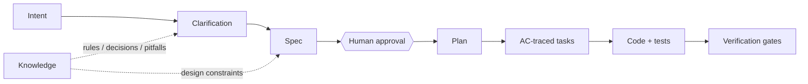
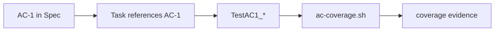

# SDD 设计

## Lattice 中的 SDD 是什么

Lattice 采用的是 Spec-driven development，而不是“多写一份需求文档”。Spec 在系统里承担三个角色：

| 角色 | 说明 |
|------|------|
| Human contract | 人类 reviewer 用它确认需求边界、设计取舍和风险。 |
| Agent contract | Agent 用它拆 plan、写代码、补测试，减少自由发挥。 |
| Verification contract | Gate 用它检查 AC 覆盖、结构完整性和 spec-code drift。 |

因此，Spec 的价值不在于内容越长越好，而在于它能被人审、被 Agent 执行、被脚本验证。

## 标准流程



阶段说明：

| 阶段 | Lattice 约束 | 产物 |
|------|--------------|------|
| Intent | 先读 manifest，识别项目上下文 | requirement 输入 |
| Clarification | 知识不足时先问，不猜 | Q&A / decisions |
| Spec | 使用模板，写清 AC、API、DDL、风险、测试策略 | `lattice/specs/*.md` |
| Approval | 人类审批后进入实现 | approved spec |
| Plan | 每个任务绑定 AC | `lattice/plans/*.md` |
| Implement | 测试命名绑定 AC | code + tests |
| Verify | 执行 pipeline，不靠自评 | terminal evidence |

## Spec 模板结构

当前模板位于：

```text
lattice/kernel/orchestrator/templates/spec-template.md
```

推荐稳定保留四个大段：

| Part | 内容 | 主要读者 |
|------|------|----------|
| Background & Goals | 背景、目标、命名规范 | 人 + Agent |
| Technical Design | 架构、时序、API、数据模型、取舍 | 人 + Agent |
| Quality Assurance | AC、风险评审、测试策略 | 人 + Gate |
| Release | 发布检查、回滚、决策日志 | 人 + Ops |

模板里的 AC 是连接 SDD 和 Harness 的关键：

```markdown
| # | When | Then | Ref step |
|---|------|------|----------|
| AC-1 | Create item | Returns 201 | ① |
| AC-2 | Get missing item | Returns 404 | ② |
```

实现时测试函数必须追踪 AC：

```go
func TestAC1_CreateItem(t *testing.T) {}
func TestAC2_GetMissingItem(t *testing.T) {}
```

## 为什么必须有人审

Lattice 把 approve 设计成 hard gate。原因不是流程保守，而是 AI coding 的错误常发生在需求解释阶段：

- Agent 可能把模糊需求补成“看起来合理”的默认行为。
- Agent 会倾向于选择最容易实现的方案。
- 如果 Spec 错了，后面的 TDD 和 gate 只会把错误执行得更稳定。

所以 human approval 应该审这些点：

- 是否解决了真实需求
- 是否遗漏关键业务规则
- API / schema / 状态机是否可长期维护
- AC 是否覆盖边界条件和失败补偿
- 风险评审是否只是占位

## AC 追踪模型

AC 是 Lattice 的轻量需求追踪矩阵。



当前 `ac-coverage.sh` 做的是结构化追踪：

- 从 Spec 表格中提取 `AC-{n}`
- 从测试文件中提取 `TestAC{n}` / `test_ac{n}` / `AC-{n}`
- 输出覆盖矩阵
- 可用 `--deep` 做空测试和 skip 检测

它解决的是“有没有测试追踪到 AC”，不是“测试语义是否真的覆盖 AC”。语义覆盖仍需要 reviewer 或后续 eval 扩展。

## Spec lint 的意义

`spec-lint.sh` 验证的是 Spec 是否满足最低执行结构：

- 必需章节存在
- AC 编号连续
- JSON 块没有 `//` 注释
- DDL 是否存在
- Mermaid 图数量提示
- Decision log 是否为空
- 风险类别是否覆盖

这类检查看起来朴素，但对团队落地很有用：它把“Spec 写得像不像可执行契约”从主观口味变成了最低门槛。

## 主要 gap

| Gap | 影响 | 建议 |
|-----|------|------|
| Spec 状态缺失 | 不知道 draft/approved/implemented/verified 的阶段 | 增加 front matter 或 `state/specs/*.json` |
| Approval 不可验证 | hard gate 目前靠流程约定 | 增加 approved_by、approved_at、spec_hash |
| AC 语义不可验证 | 有测试名不代表测对了 | 增加 test evidence、mutation/negative case 或 LLM-assisted review |
| Spec drift 粒度粗 | 正则检查无法覆盖复杂代码关系 | 引入 parser/plugin，保留 deterministic core |
| Plan 文件未强约束 | task 到 AC 的追踪还停在规则层 | 增加 plan-lint gate |

## 推荐演进

短期：

- 给 Spec 增加 YAML front matter：

```yaml
---
id: create-item-api
status: approved
owner: dolphin
approved_at: 2026-06-26
spec_hash: sha256:...
---
```

- 新增 `plan-lint.sh`，检查 plan 中每个 task 绑定 AC。
- 在 `pipeline.sh` 输出中记录 spec hash 和 git SHA。

中期：

- 建立 `requirements -> specs -> plans -> tests -> evidence` 的状态索引。
- 增加不同业务域模板，例如 API、data migration、frontend feature、batch job。
- 把 approval 和 evidence 做成可被 CI 上传的 JSON。

长期：

- 支持 Spec 版本 diff。
- 对 AC 做语义覆盖评估。
- 用历史通过/失败样本持续优化模板。
