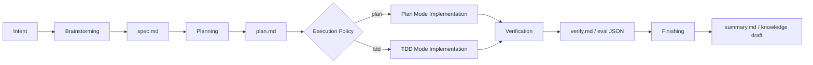

# SDD 设计

## 设计结论

Lattice 的 SDD 不应该复刻一套重型流程，也不应该只做一个 `spec.md` 模板。更专业的边界是：

> Lattice 精简 Superpowers 的 AI Coding 链路，保留真正有工程价值的控制点：Brainstorming 产出持久化 Spec，Planning 产出可执行 Plan，Implementation 根据风险选择 Plan Mode 或 TDD Mode，Verification 用独立 gate 产出证据，Finishing 只沉淀长期知识。

完整链路：

```text
Intent
  -> Brainstorming
  -> Planning
  -> Implementation(plan | tdd)
  -> Verification
  -> Finishing
```

这不是五层审批，而是五个控制点。每个控制点都必须回答一个问题：

| 阶段 | 必须回答的问题 | 产物 |
|------|----------------|------|
| Brainstorming | 我们到底要做什么，什么算做对？ | `spec.md` |
| Planning | 怎么拆成可执行、可审查的步骤？ | `plan.md` |
| Implementation | 用低摩擦 plan 执行，还是用 TDD 钉住行为？ | code / tests |
| Verification | 结果是否被独立证据证明？ | `verify.md` / eval JSON |
| Finishing | 哪些内容值得长期沉淀，哪些应该丢弃？ | `summary.md` / knowledge draft |

多一个阶段，就多一次人工损耗。因此 Lattice 不单独设置 `spec-review`、`spec-freeze`、`spec-trace` 这类阶段：它们分别收敛到 Brainstorming 出口检查、`spec.md` 状态、Verification gate 里。

## 设计原则

### 1. Spec 是持久契约，不是厚文档

Spec 的价值不在于长，而在于它能同时服务三类读者：

| 读者 | 关注点 |
|------|--------|
| Human reviewer | 意图、边界、关键决策、验收标准是否合理 |
| Agent | 约束空间、可执行步骤、不能猜的业务规则 |
| Gate | 结构、验收覆盖、漂移检测是否有基线 |

Spec 是本次执行基线，不是永久 truth。代码、测试、schema、运行证据仍是真相源；长期有价值的规则从 Spec 中提取到 knowledge。

### 2. 参考 Superpowers，但不依赖 Superpowers

Superpowers 提供了很好的 AI Coding 阶段语义：

```text
brainstorming -> writing-plans -> executing-plans / tdd -> verification -> finishing
```

Lattice 采用这条链路中对团队工程最有价值的部分，但保留自己的产物与 gate：

| Superpowers 语义 | Lattice 阶段 | Lattice 补强 |
|------------------|--------------|--------------|
| brainstorming | Brainstorming | 持久化 `spec.md`、知识注入、验收标准 |
| writing-plans | Planning | `plan.md` 必须引用 Spec |
| executing-plans | Implementation: Plan Mode | 按 plan 执行，低摩擦 |
| test-driven-dev | Implementation: TDD Mode | red test、AC 追踪、green/refactor |
| verification | Verification | 独立 pipeline，不依赖 Agent 自评 |
| finishing | Finishing | 只沉淀长期知识，避免文档腐化 |

因此，Superpowers 是可选 adapter，不是 Lattice 的基础依赖。

### 3. Plan Mode 和 TDD Mode 是 execution policy，不是两套 workflow

两种模式共享主流程：

```text
Brainstorming -> Planning -> Implementation -> Verification -> Finishing
```

区别只在 Implementation 和 Verification 的约束强度：

| 模式 | 控制点 | Verification 要求 |
|------|--------|-------------------|
| Plan Mode | `plan.md` 控制执行路径 | build/lint/test 通过，必要验收有证据 |
| TDD Mode | `plan.md` + red test 控制行为边界 | AC coverage 必须通过，测试必须追踪 AC |

一句话：

> Plan Mode 用计划约束执行路径；TDD Mode 用失败测试约束行为边界。

## 主流程



## 阶段 1：Brainstorming

### 目标

Brainstorming 负责需求澄清、上下文加载和约束收敛。它不是泛泛讨论，也不是直接写实现方案；它的唯一出口是可执行的 `spec.md`。

### 输入

- 用户原始需求
- `lattice/manifest.yaml`
- 相关代码、测试、schema、接口契约
- `lattice/knowledge/` 中命中的领域规则、历史决策、踩坑记录

### 动作

1. 识别需求意图和业务目标。
2. 加载相关知识：

```bash
bash lattice/kernel/knowledge/loader.sh <keywords>
```

3. 澄清不确定点，只问会影响边界、验收或关键决策的问题。
4. 收敛 Scope、Acceptance Criteria、关键单向门决策。
5. 判断 execution policy：`plan` 或 `tdd`。

### 产物

路径：

```text
lattice/specs/<spec-id>/spec.md
```

推荐结构：

```markdown
---
id: <spec-id>
status: drafted
execution_mode: plan | tdd
owner: <owner>
created_at: <timestamp>
---

# Spec: <title>

## Intent
一句话说明要解决的问题。

## Scope
- In:
- Out:

## Context
本次任务必须知道的少量约束，只放命中的关键规则。

## Acceptance Criteria
| # | When | Then | Verification |
|---|------|------|--------------|
| AC-1 | | | |

## Design Decisions
只记录必须人审的单向门决策，例如数据模型、接口契约、一致性策略。

## Execution Policy
- Mode: plan | tdd
- Reason:

## Verification Plan
需要运行的测试、gate、smoke 或人工验收方式。
```

### 出口标准

进入 Planning 前，`spec.md` 必须满足：

- Intent 清楚
- Scope 有明确的 in/out
- Acceptance Criteria 可验证
- Context 只包含本次任务需要的少量约束
- Design Decisions 只记录单向门，不预先锁死可由模型现场推导的实现细节
- Execution Policy 已明确

### 为什么值得存在

Brainstorming 是最高 ROI 的人工介入点。它把人的注意力放在意图、边界和验收上，而不是让人一开始就手写完整方案。

## 阶段 2：Planning

### 目标

Planning 把 `spec.md` 拆成可执行、可审查的任务序列。它参考 Superpowers 的 `writing-plans`，但产物更轻：只保留执行需要的信息。

### 输入

- `spec.md`
- 当前代码结构
- execution policy

### 产物

路径：

```text
lattice/specs/<spec-id>/plan.md
```

推荐结构：

```markdown
# Plan: <title>

## Execution Policy
plan | tdd

## Tasks

- [ ] T1: <task>
  - Ref: AC-1, AC-2
  - Files:
  - Verification:

- [ ] T2: <task>
  - Ref: AC-3
  - Files:
  - Verification:
```

TDD Mode 下，`plan.md` 需要额外标注 test-first tasks：

```markdown
## Test-first Tasks

- [ ] RED-1: Add failing test for AC-2
  - Expected failure:
  - Test file:
```

### 出口标准

- 每个 task 都引用 Scope 或 AC
- task 粒度适合人类 review，不把 2000 行黑盒改动塞进一个 task
- TDD Mode 下明确哪些 AC 需要 red test

### 为什么值得存在

Planning 是执行前最后一次低成本 review。它避免 Agent 从一份 Spec 直接跳到大范围代码修改。

## 阶段 3：Implementation

Implementation 是唯一有分支的阶段。分支不是流程分级，而是 execution policy。

### Plan Mode

Plan Mode 适合常规功能、简单 CRUD、低风险改动、已有测试覆盖较好的场景。

流程：

```text
plan.md -> code changes -> necessary tests
```

产物：

- code changes
- 必要测试
- task completion notes

规则：

- 按 `plan.md` 顺序执行
- 行为变化必须补必要测试
- 遇到 Spec 不合理，不静默偏离；记录 drift 并回到 Brainstorming 或 Planning 修正

Plan Mode 的纪律不是“随便写”，而是：

```text
Spec 固化意图，Plan 固化执行路径，Verify 固化交付证据。
```

### TDD Mode

TDD Mode 适合 Bug fix、核心链路、资金/权限/状态机、并发/幂等/异常补偿、历史回归点。

流程：

```text
plan.md -> red tests -> code changes -> green tests -> refactor
```

产物：

- failing tests
- implementation
- passing tests
- refactor notes

硬规则：

- 没有 red test，不开始实现
- 测试必须追踪 AC
- 不能通过删除、跳过、放宽测试换绿
- refactor 后测试仍必须保持 green

测试命名建议：

```go
func TestAC1_CreateItem(t *testing.T) {}
```

```python
def test_ac1_create_item():
    ...
```

```typescript
describe("AC-1: create item", () => {})
```

TDD Mode 的价值不是流程更重，而是把高风险行为变成可执行约束。测试吃掉 Spec 中最容易腐化的可执行部分。

## 阶段 4：Verification

### 目标

Verification 用独立 gate 验证结果，不接受 Agent 自评。

### 输入

- `spec.md`
- `plan.md`
- code changes
- tests
- `manifest.yaml`

### 产物

当前可先用 Markdown：

```text
lattice/specs/<spec-id>/verify.md
```

后续应补结构化 evidence：

```text
lattice/state/eval-runs/<run-id>.json
```

### Gate

推荐 gate：

```text
spec-lint
build
lint
unit-test
ac-coverage
integration-test / smoke
drift-check
compliance
```

Plan Mode 和 TDD Mode 要求不同：

| Gate | Plan Mode | TDD Mode |
|------|-----------|----------|
| spec-lint | 必须 | 必须 |
| build/lint/test | 必须 | 必须 |
| ac-coverage | 按风险启用 | 必须 |
| drift-check | 有 API/schema/错误码变更时必须 | 有 API/schema/错误码变更时必须 |
| compliance | 软 gate | 软 gate，可 strict |

`verify.md` 示例：

```markdown
# Verify: <title>

## Run
- Spec: lattice/specs/<id>/spec.md
- Plan: lattice/specs/<id>/plan.md
- Commit: <sha>
- Mode: tdd

## Results
| Gate | Result | Evidence |
|------|--------|----------|
| spec-lint | PASS | ... |
| unit-test | PASS | ... |
| ac-coverage | PASS | AC-1/AC-2 covered |
| drift-check | PASS | no drift |

## Decision
PASS / FAIL / ESCALATED
```

### 出口标准

- 所有必需 gate 通过
- 失败时进入有限 retry
- 超过 retry budget 后 escalation，不继续自修复

### 为什么值得存在

Verification 是 Lattice 区别于普通 prompt workflow 的关键：它把“完成了”变成可复现证据。

## 阶段 5：Finishing

### 目标

Finishing 收口交付，不制造长期文档债。它参考 Superpowers 的 finishing，但只保留三件事：

1. 记录最终状态
2. 关联验证证据
3. 提取长期知识

### 产物

```text
lattice/specs/<spec-id>/summary.md
lattice/knowledge/<slug>.md      # optional
```

`summary.md` 示例：

```markdown
# Summary: <title>

## Status
completed / partial / reverted / escalated

## Evidence
- Verify run:
- Tests:
- Commit:

## Changes
- ...

## Knowledge Candidates
- <rule / pitfall / decision>
```

### 沉淀规则

沉淀到 knowledge：

- 业务铁律
- 事故经验
- 高频坑
- 跨需求复用的领域约束
- 不可逆设计决策

不沉淀：

- 一次性 plan
- 和代码重复的描述
- 临时实现细节
- 已由测试稳定表达的普通行为

### 为什么值得存在

Finishing 的价值是防腐：把可复用知识从本次 Spec 中提取出去，让 Spec 保持一次性执行基线，而不是变成没人维护的长期文档。

## Skills 设计

Lattice 的 SDD skills 应该与阶段一一对应，但保持克制。

| Skill | 阶段 | 产物 |
|-------|------|------|
| `/brainstorm` | Brainstorming | `spec.md` |
| `/plan` | Planning | `plan.md` |
| `/implement` | Implementation | code / tests |
| `/verify` | Verification | `verify.md` / eval JSON |
| `/finish` | Finishing | `summary.md` / knowledge draft |

`/implement` 读取 `spec.md` 中的 execution policy：

```yaml
execution_mode: plan
```

或：

```yaml
execution_mode: tdd
```

不建议增加独立 `/spec-review`、`/spec-freeze`、`/spec-trace`：

| 不独立成阶段 | 收敛位置 |
|--------------|----------|
| spec review | Brainstorming 出口标准 |
| spec freeze | `spec.md` 状态与 hash |
| trace | Verification 的 `ac-coverage` |
| update | 失败或 drift 时回到 Brainstorming/Planning |

## 状态模型

建议给 `spec.md` 增加最小 front matter：

```yaml
---
id: create-item-api
status: drafted | planned | implemented | verified | finished | escalated
execution_mode: plan | tdd
owner: dolphin
created_at: 2026-06-26T12:00:00+08:00
updated_at: 2026-06-26T12:30:00+08:00
spec_hash: sha256:...
---
```

状态推进：

```text
drafted -> planned -> implemented -> verified -> finished
                         \-> escalated
```

状态只服务追踪和 gate，不引入复杂工作流引擎。

## 文件布局

推荐把一次需求的产物放在同一目录：

```text
lattice/specs/<spec-id>/
├── spec.md
├── plan.md
├── verify.md
└── summary.md
```

这样比散落在 `specs/`、`plans/`、`state/` 更方便 code review，也更符合“一次需求一组契约产物”的心智。

结构化 eval 仍可放在：

```text
lattice/state/eval-runs/<run-id>.json
```

## 与当前实现的差距

| Gap | 影响 | 建议 |
|-----|------|------|
| SDD skills 仍是 Markdown 指令 | 无法机器强制每个阶段的输入/输出 | 增加对应 CLI/gate 或 structured evidence |
| `spec.md` 状态未被 gate 消费 | 无法强制阶段推进 | 让 `spec-lint` 校验 front matter 状态和 `execution_mode` |
| `plan.md` 未被 gate 检查 | task 可能没有追踪 AC | 增加 `plan-lint.sh` |
| Verification 只有文本输出 | 不利于趋势和回放 | 增加 eval JSON |
| TDD policy 未被 gate 强制 | 无法确认 red-before-green | 增加 TDD gate 或 test evidence |
| example 仍使用旧 spec 文件布局 | 新用户无法一眼看到推荐结构 | 增加 `lattice/specs/<id>/` 示例 |

## 推荐落地顺序

1. 为 `spec.md` front matter 增加 gate 校验。
2. 增加 `plan-lint.sh`，检查 task 是否引用 Scope 或 AC。
3. 增加 TDD evidence 检查，记录 red-before-green。
4. 增加 `pipeline.sh --json-out`，把 verification 证据结构化。
5. 更新 example，展示 `lattice/specs/<id>/{spec,plan,verify,summary}.md` 推荐布局。

## 最小专业定义

> Lattice SDD 是一条克制的 AI Coding 契约链路：Brainstorming 生成持久化 Spec，Planning 生成可审查 Plan，Implementation 按 Plan Mode 或 TDD Mode 执行，Verification 给出独立证据，Finishing 只沉淀长期知识。它参考 Superpowers 的阶段语义，但不依赖 Superpowers，也不重复实现完整 workflow engine。
