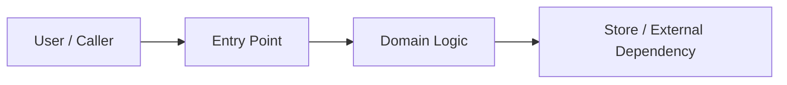
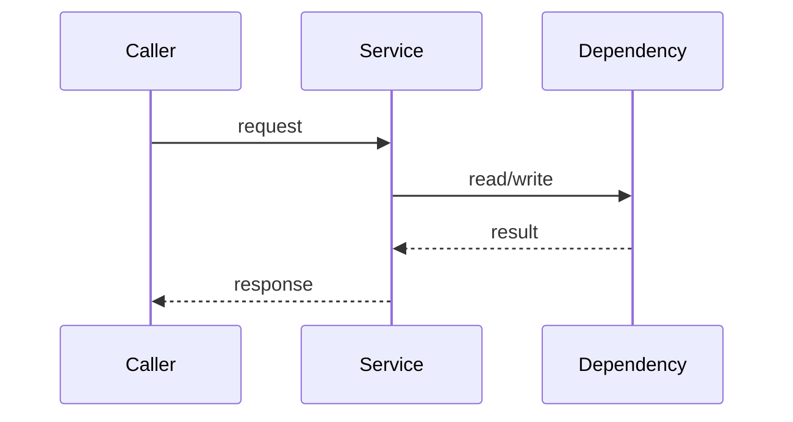

# Spec: {Title}

## 0. 一屏摘要 (One-Page Summary)

> 好 spec 先降低 review 成本。Reviewer 应该能在三分钟内判断：该不该做、改哪里、主要风险是什么、怎么证明做对。
> 推荐审查顺序：一屏摘要 -> 关键图 -> 不变量 -> 验收 -> 漂移控制；附录最后看。

| 项 | 内容 |
|------|-------|
| 问题 (Problem) | {要解决的真实问题，不只写功能名} |
| 目标用户 / 系统 (Target) | {谁受影响，哪个系统行为会改变} |
| 成功标准 (Success Criteria) | {成功后可观察、可验证的状态} |
| 范围 (Scope) | {本次明确交付什么} |
| 非目标 (Non-goals) | {本次明确不做什么；AI 不会从省略推断边界} |
| 主图 (Primary Diagram) | context / component / sequence / state / data / rollout / N/A |
| 风险等级 (Risk Level) | low / medium / high |
| 执行模式 (Execution Mode) | `{plan|tdd}` |
| 验证证据 (Verification Proof) | {最关键的测试、命令、gate 或人工验收} |
| 审查重点 (Review Focus) | intent / boundary / flow / state / data / contract / acceptance / drift |
| 结论 (Decision) | ready / needs-clarification / blocked |

## 1. 上下文依据 (Context Basis)

> Spec 是 AI 的外挂记忆，只记录会影响 Scope、Views、Contracts、Invariants、Acceptance 或 Execution Policy 的已采用事实；不复制完整代码、知识库或聊天记录。没有外部依据时写 N/A。

| 来源 (Source) | 约束 / 事实 (Constraint / Fact) | 影响 (Impact) |
|--------|-------------------|--------|
| user request | | |
| code / tests | | |
| docs / knowledge | | |
| incidents / metrics / support | | |
| open questions / conflicts | | |

## 2. 关键图示 (Key Diagrams)

> 图不是装饰，是为了让 review 更便宜。按风险选择 1-3 张关键图；低风险任务可以只保留改动落点图或写 N/A。
> 不要保留占位图。每张图必须能回答一个 review 问题；没有图时必须写明 N/A 理由。

### 2.1 图示选择 (Diagram Selection)

| 视图 (View) | 适用场景 (Use When) | 审查问题 (Review Question) | 决策 (Decision) |
|------|----------|-----------------|----------|
| Context / Component | 改模块、跨边界、影响上下游 | 改动落点和上下游是否清楚？ | include / N/A because... |
| Sequence | 有多步链路、外部调用、异常路径 | 核心业务链路和异常路径是否清楚？ | include / N/A because... |
| State | 有状态迁移、审批、订单、任务、重试 | 状态迁移、不变量和终态是否清楚？ | include / N/A because... |
| ER / Data Flow | 有数据模型、权限、资产、库存或副作用 | 数据关系、读写路径和副作用是否清楚？ | include / N/A because... |
| Deployment / Rollout | 有上线、灰度、依赖、容量或回滚风险 | 发布路径和回滚边界是否清楚？ | include / N/A because... |

图示规则 (Diagram Rules):

- 优先一张主图，不堆装饰性图。
- 明确标注 changed nodes / changed edges。
- 按需展示 boundary、direction、state、data ownership、rollback points。
- 不影响 review 的细节放到 Appendix。

### 2.2 主审查视图 (Primary Review View)



### 2.3 辅助视图：关键流程 / 状态 / 数据 (Critical Flow / State / Data)



## 3. 契约与不变量 (Contracts / Invariants)

> Spec 不只写“怎么改”，还要写“什么绝不能被破坏”。
> 未变化的契约写 N/A，并给出依据；不要让 reviewer 猜“没写”是未影响还是漏写。

### 3.1 契约面 (Contract Surface)

| 契约 (Contract) | 变更 (Change) | 兼容性 (Compatibility) | 负责人 / 证据 (Owner / Evidence) |
|----------|--------|---------------|------------------|
| API / route | | backward-compatible / breaking / N/A | |
| Schema / data | | backward-compatible / migration / N/A | |
| UI / component | | compatible / changed / N/A | |
| Config / env | | default-safe / requires rollout / N/A | |
| Events / jobs | | compatible / changed / N/A | |

### 3.2 命名与数据语义 (Naming And Data Semantics)

| 层 (Layer) | 风格 / 规则 (Style / Rule) | 示例 / 说明 (Example / Note) |
|-------|--------------|----------------|
| API JSON field | camelCase unless project says otherwise | `userId`, `itemName` |
| Code identifier | project convention | `UserID`, `ItemID`, `user_id` |
| Database column | snake_case unless project says otherwise | `user_id`, `item_name` |
| Error / result code | project convention | `ErrNotFound`, `ITEM_NOT_FOUND` |
| URL path | kebab-case resource noun | `/api/v1/items` |
| Config / env | UPPER_SNAKE_CASE | `ITEM_CACHE_TTL` |

### 3.3 不变量 (Invariants)

> 推荐用 EARS 写关键不变量。没有高风险不变量时写 N/A。
> 不变量要少而硬：被破坏时应导致测试失败、review fail 或 release block。

```text
WHEN {trigger}
THE SYSTEM SHALL {response}

WHILE {state}
THE SYSTEM SHALL {constraint}
```

| 不变量 (Invariant) | 必须成立的原因 | 验证方式 (Verification) |
|-----------|------------------|--------------|
| idempotency / permission / data consistency / concurrency / regression | | |
| asset / billing / inventory / critical side effect | | |
| rollout / rollback / migration | | |

### 3.4 三段式边界 (Three-Tier Boundaries)

| 层级 (Tier) | 边界 (Boundary) |
|------|----------|
| Always do | {无需再问，必须遵守的规则} |
| Ask first | {高影响动作，需要用户确认} |
| Never | {硬停止，绝不能做；例如提交密钥、扩大范围、破坏兼容性} |

## 4. 验收与测试 (Acceptance / Tests)

> 每条 AC 都必须绑定测试、样例、命令、gate 或人工检查点。AI 不能验证形容词，只能验证事实、数字、样例和命令结果。
> 优先一条业务规则一条 AC；不要写只证明实现存在、但不证明业务成立的验收项。

### 4.1 功能性 AC (Functional Acceptance Criteria)

```gherkin
Scenario: {场景名}
  Given {前置条件}
  When {触发动作}
  Then {可观察结果}
```

| # | Given | When | Then | 验证方式 (Verification) |
|---|-------|------|------|--------------|
| AC-1 | | | | unit / integration / e2e / manual / gate |

### 4.2 样例 (Examples)

| ID | 输入 (Input) | 前置条件 (Precondition) | 期望输出 (Expected Output) | 副作用 (Side Effect) | AC |
|----|-------|--------------|-----------------|-------------|----|
| EX-1 | | | | | AC-1 |

### 4.3 失败 / 边界 / 回归 (Failure / Boundary / Regression)

| # | 故障 / 条件 (Fault / Condition) | 期望状态 (Expected State) | 错误 / 结果 (Error / Result) | 验证方式 (Verification) |
|---|-------------------|----------------|----------------|--------------|
| AC-2 | | | | |

### 4.4 非功能 Fit Criteria (Non-Functional Fit Criteria)

| # | 维度 / 命令 (Dimension / Command) | 阈值 / 期望结果 (Threshold / Expected Result) |
|---|---------------------|-----------------------------|
| AC-n | build / lint / type-check | zero error |
| AC-n | performance / latency | concrete threshold or N/A |
| AC-n | observability / alert | signal exists or N/A |

## 5. 漂移控制 (Drift Control)

> Spec 写完以后最大的风险是漂移。图、spec、测试、代码必须形成闭环。
> 如果某类漂移不适用，写 N/A；如果适用，必须写谁负责检查。

| 漂移触发器 (Drift Trigger) | 必须更新 (Required Update) | 检查 / 负责人 (Check / Owner) |
|---------------|-----------------|---------------|
| API / field / message changes | update Contract Surface and related AC | |
| state machine / workflow changes | update State / Sequence view and invariants | |
| data model / migration changes | update Data Model and rollback plan | |
| permission / tenancy / privacy changes | update boundaries and security AC | |
| test behavior changes | update Acceptance Binding | |
| rollout / deployment changes | update Release / Rollback checklist | |

## 6. 执行策略 (Execution Policy)

- Mode: `{plan|tdd}`
- Reason: {为什么选这个模式；高风险、回归、权限、状态机、数据迁移、并发、幂等等应优先 `tdd`}
- Source: `model-selected | project-default | user-override`
- Escalation: `plan -> tdd` allowed if new risk is discovered; `tdd -> plan` requires explicit user override.

## 7. 验证计划 (Verification Plan)

| Gate / Test | 是否必需 (Required?) | 证据 (Evidence) |
|-------------|-----------|----------|
| build | yes / no | |
| lint / type-check | yes / no | |
| unit test | yes / no | |
| AC coverage | yes / no | |
| integration / e2e | conditional | |
| drift / contract check | conditional | |
| release smoke / manual check | conditional | |

## 8. 待确认问题 (Open Questions)

> 只保留会阻塞 Scope、Views、Contracts、Invariants、Acceptance 或 Execution Policy 的问题。

- [ ] {question}

## Appendix A — 技术细节 (Technical Details)

> 详细方案放附录，避免普通 review 一上来读长文。只有复杂需求、跨系统变更、迁移、性能或高风险链路需要展开。
> 低风险 `plan` 任务可以把本附录整体写 N/A。

### A.1 技术方案 (Technical Approach)

| 项 | 选择 (Choice) | 原因 / 约束 (Reason / Constraint) |
|------|--------|---------------------|
| Language / framework | | |
| Storage / external service | | |
| Deployment / runtime | | |
| Compatibility boundary | | |

### A.2 API / 消息协议 (API / Message Protocol)

| API / Message | 方法 / 类型 (Method / Type) | 路径 / Topic | Auth | Request | Response / Event | Error Codes |
|---------------|---------------|--------------|------|---------|------------------|-------------|
| | | | | | | |

### A.3 数据模型 / 迁移 (Data Model / Migration)

```sql
-- Include only changed or newly introduced tables / columns.
-- Include indexes and rollback notes when applicable.
```

| 对象 (Object) | 索引 / 约束 (Index / Constraint) | 用途 (Purpose) | 覆盖流程 / AC |
|--------|--------------------|---------|-------------------|
| | | | |

### A.4 设计决策 (Design Decisions)

| # | 决策 (Decision) | 理由 (Rationale) | 备选方案 (Alternatives) | 可逆? (Reversible?) |
|---|----------|-----------|--------------|-------------|
| D-1 | | | | yes / no |

### A.5 发布 / 回滚清单 (Release / Rollback Checklist)

| 项 | 计划 (Plan) | 负责人 / 证据 (Owner / Evidence) |
|------|------|------------------|
| config / env | | |
| migration / seed | | |
| observability / alert | | |
| rollout | | |
| rollback | | |
| smoke / post-check | | |
