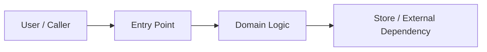
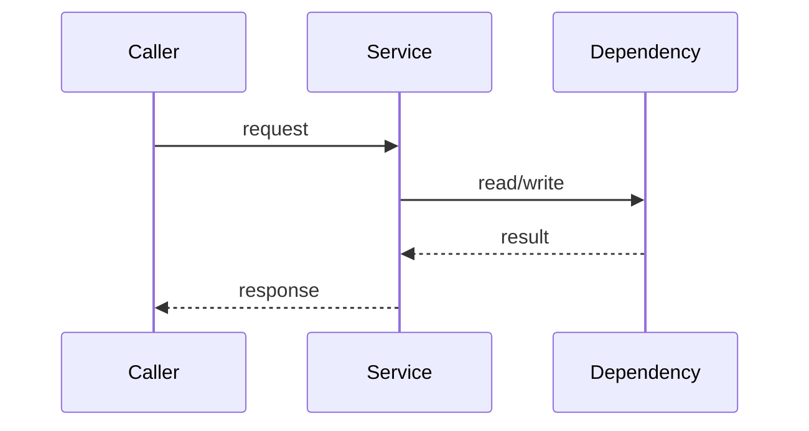

# Spec: {Title}

## 0. One-Page Summary

> 好 spec 先降低 review 成本。Reviewer 应该能在三分钟内判断：该不该做、改哪里、主要风险是什么、怎么证明做对。

| Item | Value |
|------|-------|
| Problem | {要解决的真实问题，不只写功能名} |
| Target user / system | {谁受影响，哪个系统行为会改变} |
| Success criteria | {成功后可观察、可验证的状态} |
| Scope | {本次明确交付什么} |
| Non-goals | {本次明确不做什么；AI 不会从省略推断边界} |
| Risk level | low / medium / high |
| Execution mode | `{plan|tdd}` |
| Review focus | intent / boundary / flow / state / data / contract / acceptance / drift |
| Decision | ready / needs-clarification / blocked |

## 1. Context Basis

> Spec 是 AI 的外挂记忆，只记录会影响 Scope、Views、Contracts、Invariants、Acceptance 或 Execution Policy 的已采用事实；不复制完整代码、知识库或聊天记录。没有外部依据时写 N/A。

| Source | Constraint / Fact | Impact |
|--------|-------------------|--------|
| user request | | |
| code / tests | | |
| docs / knowledge | | |
| incidents / metrics / support | | |
| open questions / conflicts | | |

## 2. Key Diagrams

> 图不是装饰，是为了让 review 更便宜。按风险选择 1-3 张关键图；低风险任务可以只保留改动落点图或写 N/A。

### 2.1 Diagram Selection

| Diagram | Required? | Review Question | Evidence |
|---------|-----------|-----------------|----------|
| Context / Component | yes / no | 改动落点和上下游是否清楚？ | |
| Sequence | yes / no | 核心业务链路和异常路径是否清楚？ | |
| State | yes / no | 状态迁移、不变量和终态是否清楚？ | |
| ER / Data Flow | yes / no | 数据关系、权限、资产、库存或副作用是否清楚？ | |
| Deployment / Rollout | yes / no | 上线、灰度、回滚、依赖和容量风险是否清楚？ | |

### 2.2 Primary View



### 2.3 Critical Flow / State



## 3. Contracts / Invariants

> Spec 不只写“怎么改”，还要写“什么绝不能被破坏”。

### 3.1 Contract Surface

| Contract | Change | Compatibility | Owner / Evidence |
|----------|--------|---------------|------------------|
| API / route | | backward-compatible / breaking / N/A | |
| Schema / data | | backward-compatible / migration / N/A | |
| UI / component | | compatible / changed / N/A | |
| Config / env | | default-safe / requires rollout / N/A | |
| Events / jobs | | compatible / changed / N/A | |

### 3.2 Naming And Data Semantics

| Layer | Style / Rule | Example / Note |
|-------|--------------|----------------|
| API JSON field | camelCase unless project says otherwise | `userId`, `itemName` |
| Code identifier | project convention | `UserID`, `ItemID`, `user_id` |
| Database column | snake_case unless project says otherwise | `user_id`, `item_name` |
| Error / result code | project convention | `ErrNotFound`, `ITEM_NOT_FOUND` |
| URL path | kebab-case resource noun | `/api/v1/items` |
| Config / env | UPPER_SNAKE_CASE | `ITEM_CACHE_TTL` |

### 3.3 Invariants

> 推荐用 EARS 写关键不变量。没有高风险不变量时写 N/A。

```text
WHEN {trigger}
THE SYSTEM SHALL {response}

WHILE {state}
THE SYSTEM SHALL {constraint}
```

| Invariant | Why It Must Hold | Verification |
|-----------|------------------|--------------|
| idempotency / permission / data consistency / concurrency / regression | | |
| asset / billing / inventory / critical side effect | | |
| rollout / rollback / migration | | |

### 3.4 Three-Tier Boundaries

| Tier | Boundary |
|------|----------|
| Always do | {无需再问，必须遵守的规则} |
| Ask first | {高影响动作，需要用户确认} |
| Never | {硬停止，绝不能做；例如提交密钥、扩大范围、破坏兼容性} |

## 4. Acceptance / Tests

> 每条 AC 都必须绑定测试、样例、命令、gate 或人工检查点。AI 不能验证形容词，只能验证事实、数字、样例和命令结果。

### 4.1 Functional AC

```gherkin
Scenario: {场景名}
  Given {前置条件}
  When {触发动作}
  Then {可观察结果}
```

| # | Given | When | Then | Verification |
|---|-------|------|------|--------------|
| AC-1 | | | | unit / integration / e2e / manual / gate |

### 4.2 Examples

| ID | Input | Precondition | Expected Output | Side Effect | AC |
|----|-------|--------------|-----------------|-------------|----|
| EX-1 | | | | | AC-1 |

### 4.3 Failure / Boundary / Regression

| # | Fault / Condition | Expected State | Error / Result | Verification |
|---|-------------------|----------------|----------------|--------------|
| AC-2 | | | | |

### 4.4 Non-Functional Fit Criteria

| # | Dimension / Command | Threshold / Expected Result |
|---|---------------------|-----------------------------|
| AC-n | build / lint / type-check | zero error |
| AC-n | performance / latency | concrete threshold or N/A |
| AC-n | observability / alert | signal exists or N/A |

## 5. Drift Control

> Spec 写完以后最大的风险是漂移。图、spec、测试、代码必须形成闭环。

| Drift Trigger | Required Update | Check / Owner |
|---------------|-----------------|---------------|
| API / field / message changes | update Contract Surface and related AC | |
| state machine / workflow changes | update State / Sequence view and invariants | |
| data model / migration changes | update Data Model and rollback plan | |
| permission / tenancy / privacy changes | update boundaries and security AC | |
| test behavior changes | update Acceptance Binding | |
| rollout / deployment changes | update Release / Rollback checklist | |

## 6. Execution Policy

- Mode: `{plan|tdd}`
- Reason: {为什么选这个模式；高风险、回归、权限、状态机、数据迁移、并发、幂等等应优先 `tdd`}
- Source: `model-selected | project-default | user-override`
- Escalation: `plan -> tdd` allowed if new risk is discovered; `tdd -> plan` requires explicit user override.

## 7. Verification Plan

| Gate / Test | Required? | Evidence |
|-------------|-----------|----------|
| build | yes / no | |
| lint / type-check | yes / no | |
| unit test | yes / no | |
| AC coverage | yes / no | |
| integration / e2e | conditional | |
| drift / contract check | conditional | |
| release smoke / manual check | conditional | |

## 8. Approval

| Item | Value |
|------|-------|
| Status | explicit / inferred / skipped-with-reason |
| Source | user message / project default / reason |
| Notes | |

## 9. Open Questions

> 只保留会阻塞 Scope、Views、Contracts、Invariants、Acceptance 或 Execution Policy 的问题。

- [ ] {question}

## Appendix A — Technical Details

> 详细方案放附录，避免普通 review 一上来读长文。只有复杂需求、跨系统变更、迁移、性能或高风险链路需要展开。

### A.1 Technical Approach

| Item | Choice | Reason / Constraint |
|------|--------|---------------------|
| Language / framework | | |
| Storage / external service | | |
| Deployment / runtime | | |
| Compatibility boundary | | |

### A.2 API / Message Protocol

| API / Message | Method / Type | Path / Topic | Auth | Request | Response / Event | Error Codes |
|---------------|---------------|--------------|------|---------|------------------|-------------|
| | | | | | | |

### A.3 Data Model / Migration

```sql
-- Include only changed or newly introduced tables / columns.
-- Include indexes and rollback notes when applicable.
```

| Object | Index / Constraint | Purpose | Covered Flow / AC |
|--------|--------------------|---------|-------------------|
| | | | |

### A.4 Design Decisions

| # | Decision | Rationale | Alternatives | Reversible? |
|---|----------|-----------|--------------|-------------|
| D-1 | | | | yes / no |

### A.5 Release / Rollback Checklist

| Item | Plan | Owner / Evidence |
|------|------|------------------|
| config / env | | |
| migration / seed | | |
| observability / alert | | |
| rollout | | |
| rollback | | |
| smoke / post-check | | |
